# COVID Image Classification

## Launch a Jupyter Notebook
Let's launch a Jupyter notebook **covidmgmt** as shown below and also ensure that we have sufficient CPU cores to run some of the algorithms. I had to increase the minimum CPU count to 4 and maximum count to 8. Also the memory for this pod had to be increased from minimum 2Gi to maximum 4Gi


Once the notebook pod comes up, please click on the CONNECT link to launch a new tab for the notebook as shown below. Here we should be able to write the code for python and also upload any test data as required


::: tip
I had some issues launching **tensorflow** based pods as the version that was specified in the **spawner_ui_config.yaml** was **v1.8.0-rc.0** and it was not available for arm64 architecture so I had to update it to **v1.8.0** for the following docker images

```
apps/jupyter/jupyter-web-app/upstream/base/configs/spawner_ui_config.yaml
```


Once the version of the images is updated, relaunch the jupyter-web-app pod again with the below command to reflect the new docker images

```
kustomize build apps/jupyter/jupyter-web-app/upstream/overlays/istio | kubectl apply -f -
```

If there are issues, please restart the entire kubeflow namespace using the below command
```
kubectl -n kubeflow rollout restart deploy
```

:::

**`Now, let's look at the actual problem at hand to see if it runs on our localhost`**

## Problem Statement
COVID-19 was a pandemic that hit the world during 2020. It caused immense damage to the human population by affecting their lungs. An Xray scan of COVID-19 patients revealed more damage compared to the patients affected by pneumonia or that were normal. This problem uses a sample dataset of patients affected by viral pneumonia and covid compares them with healthy patients to understand the damage caused and also to build a Convolutional Neural Network model that can be trained on the images for prediction of new patients Xray scans

### Import python packages as necessary

The Jupyter Notebook uses a pod that was prebuilt with tensorflow 2.13.0 version (arm64) but still requires the opencv-python library so it was installed using the pip install command as shown below

```python
pip install -U opencv-python-headless
```

    Requirement already satisfied: opencv-python-headless in /opt/conda/lib/python3.11/site-packages (4.9.0.80)
    Requirement already satisfied: numpy>=1.21.2 in /opt/conda/lib/python3.11/site-packages (from opencv-python-headless) (1.24.3)
    Note: you may need to restart the kernel to use updated packages.


```python
import tensorflow as tf
print(tf.__version__)
```

    2.13.0


```python
#Reading the training images from the path and labelling them into the given categories
import numpy as np
import pandas as pd
import matplotlib.pyplot as plt
import cv2
import os
import h5py
import seaborn as sns # for data visualization 
import tensorflow as tf
from tensorflow import keras
from tensorflow.keras.models import Sequential #sequential api for sequential model 
from tensorflow.keras.layers import Dense, Dropout, Flatten #importing different layers 
from tensorflow.keras.layers import Conv2D, MaxPooling2D, BatchNormalization, Activation, Input, LeakyReLU,Activation
from tensorflow.keras import backend as K
from tensorflow.keras.utils import to_categorical #to perform one-hot encoding 
from tensorflow.keras.layers import Dense, Dropout, Flatten, Conv2D, MaxPool2D
from tensorflow.keras.optimizers import RMSprop,Adam #optimiers for optimizing the model
from tensorflow.keras.callbacks import EarlyStopping  #regularization method to prevent the overfitting
from tensorflow.keras.callbacks import ModelCheckpoint
from tensorflow.keras.models import Sequential, Model
from tensorflow.keras import losses, optimizers
```

## Data Description

### List the data files to read


```python
# Open the file as readonly
trainImages = np.load('trainimage.npy')
trainLabels = pd.read_csv('trainLabels.csv')

print(trainImages.shape)
print(trainLabels.shape)
```

    (251, 128, 128, 3)
    (251, 1)


### As shown above, there are 251 images which are 128x128 size and there are 3 channels

### Let's show some images


```python
# Show some example images
for i in range(8):
    plt.subplot(2, 4, i + 1)
    plt.imshow(trainImages[i])
```


    

    


### Let's check the data balance


```python
sns.countplot(trainLabels['Label'])
plt.xticks(rotation='vertical')
```


    (array([  0.,  20.,  40.,  60.,  80., 100., 120.]),
     [Text(0.0, 0, '0'),
      Text(20.0, 0, '20'),
      Text(40.0, 0, '40'),
      Text(60.0, 0, '60'),
      Text(80.0, 0, '80'),
      Text(100.0, 0, '100'),
      Text(120.0, 0, '120')])


    
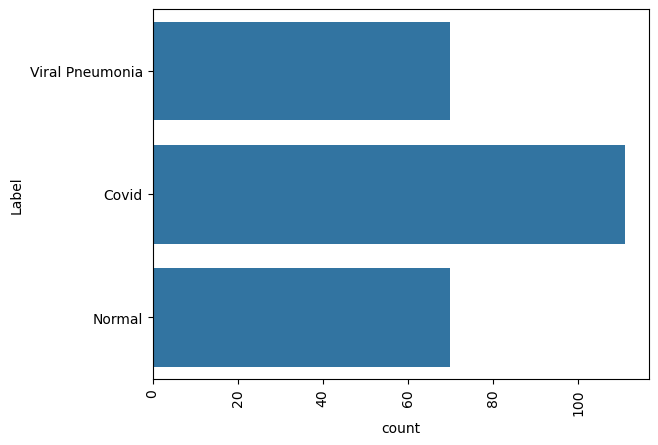
    


#### As shown above, data is quite balanced but covid patients seem to be more in number 

## Exploratory Data Analysis


```python
def find_mean_img(full_mat):
    # calculate the average
    mean_img = np.mean(full_mat, axis = 0)
    # reshape it back to a matrix
    mean_img = mean_img.reshape((150,150))
  
    return mean_img

CATEGORIES=trainLabels['Label'].unique()
d={ i:[] for i in CATEGORIES}

for i in trainLabels.index:
  gray = cv2.cvtColor(trainImages[i], cv2.COLOR_BGR2GRAY)
  gray = cv2.resize(gray,(150,150))
  d[trainLabels['Label'][i]].append(gray)

l=[]
for i in d.keys():
  l.append(find_mean_img(d[i]))

plt.subplots(figsize=(12,12))
for i in range(len(l)):
    plt.subplot(3,4,i + 1,title='Average '+list(d.keys())[i])
    plt.imshow(l[i])
    plt.axis('off')
```


    
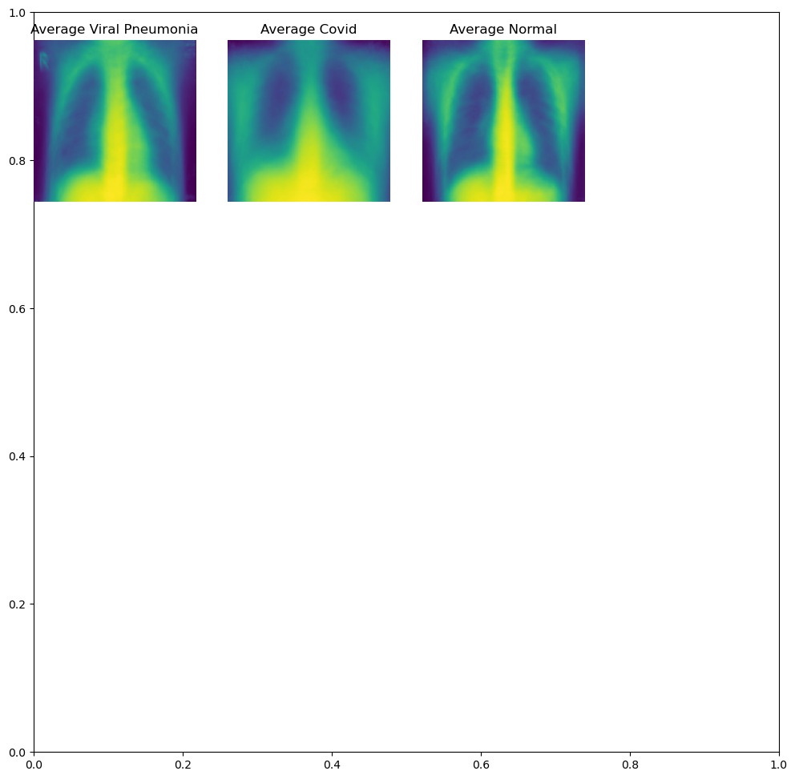
    


#### From the above picture, we can see that on an average a covid patient has a much weeker depiction of his/her lungs (due to infection) in the images compared to the other two categories - normal category is much better viewable

## Data Preprocessing 

### Let's do the following as part of Image Preprocessing
* Convert the images to HSV (Better colors)
* Use Gaussian Blurring to reduce the noise
* Visualize the data after pre-processing


```python
new_train = []
sets = []; getEx = True
for i in trainImages:
    blurr = cv2.GaussianBlur(i,(5,5),0)
    hsv = cv2.cvtColor(blurr,cv2.COLOR_BGR2HSV) #Using BGR TO HSV conversion. reason is mentioned above
    #HSV Bou daries for the Green color (GREEN PARAMETERS)
    lower = (25,40,50)
    upper = (75,255,255)
    mask = cv2.inRange(hsv,lower,upper) # create a mask 
    boolean = mask>0
    new = np.zeros_like(i,np.uint8)
    new[boolean] = i[boolean]
    new_train.append(blurr)
    if getEx:
        plt.subplot(2,3,1);plt.imshow(i) # ORIGINAL
        plt.subplot(2,3,2);plt.imshow(blurr) # BLURRED
        plt.subplot(2,3,3);plt.imshow(hsv) # HSV CONVERTED
        plt.subplot(2,3,6);plt.imshow(new) # NEW PROCESSED IMAGE
        plt.show()
        getEx = False
new_train = np.asarray(new_train)
print("# CLEANED IMAGES")
for i in range(8):
    plt.subplot(2,4,i+1)
    plt.imshow(new_train[i])
```


    
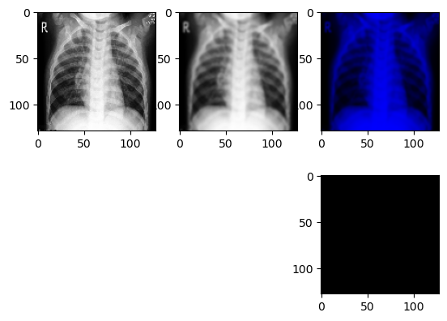
    


    # CLEANED IMAGES


    
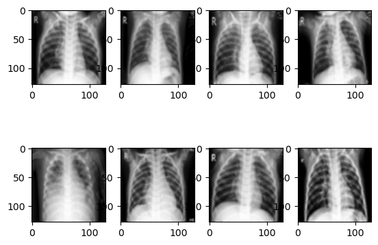
    


As shown above, its better to take the gaussian blurred images as the final processed images compared to HSV / Mask removed as they seem to be more darker 

### Normalization


```python
# Normalize image data.
new_train = new_train / 255
```

### Convert the Labels 


```python
# Convert labels from digits to one hot vectors.

from sklearn.preprocessing import LabelBinarizer
enc = LabelBinarizer()
y = enc.fit_transform(trainLabels)
```


```python
print(y.shape)
print(new_train.shape)
```

    (251, 3)
    (251, 128, 128, 3)


### Split the dataset


```python
from sklearn.model_selection import train_test_split
X_train, X_test, y_train, y_test = train_test_split(new_train,y , test_size=0.1, random_state=7,stratify=y)
```


```python
print(X_train.shape)
print(y_train.shape)
print(X_test.shape)
print(y_test.shape)
```

    (225, 128, 128, 3)
    (225, 3)
    (26, 128, 128, 3)
    (26, 3)


### Check the class proportion as we have used stratify to have an equal distribution of the dataset


```python
pd.DataFrame(y_train.argmax(axis=1)).value_counts()/pd.DataFrame(y_train.argmax(axis=1)).value_counts().sum()
```


    0    0.44
    1    0.28
    2    0.28
    Name: count, dtype: float64


```python
pd.DataFrame(y_test.argmax(axis=1)).value_counts()/pd.DataFrame(y_test.argmax(axis=1)).value_counts().sum()
```


    0    0.461538
    1    0.269231
    2    0.269231
    Name: count, dtype: float64


## Build the CNN Model


```python
from tensorflow.keras.utils import to_categorical # convert to one-hot-encoding
from tensorflow.keras.models import Sequential
from tensorflow.keras.layers import Dense, Dropout, Flatten, Conv2D, MaxPool2D, GlobalMaxPooling2D
from tensorflow.keras.optimizers import RMSprop
from tensorflow.keras.preprocessing.image import ImageDataGenerator
from tensorflow.keras.optimizers import Adam

# Set the CNN model 
batch_size=50


model = Sequential()

model.add(Conv2D(filters = 32, kernel_size = (5,5),padding = 'Same', 
                 activation ='relu', batch_input_shape = (batch_size,128, 128, 3)))


model.add(Conv2D(filters = 32, kernel_size = (5,5),padding = 'Same', 
                 activation ='relu'))
model.add(MaxPool2D(pool_size=(2,2)))
model.add(Dropout(0.2))


model.add(Conv2D(filters = 64, kernel_size = (3,3),padding = 'Same', 
                 activation ='relu'))
model.add(Conv2D(filters = 64, kernel_size = (3,3),padding = 'same', 
                 activation ='relu'))
model.add(MaxPool2D(pool_size=(2,2), strides=(2,2)))
model.add(Dropout(0.3))

model.add(Conv2D(filters = 128, kernel_size = (3,3),padding = 'Same', 
                 activation ='relu'))
model.add(Conv2D(filters = 128, kernel_size = (3,3),padding = 'Same', 
                 activation ='relu'))
model.add(MaxPool2D(pool_size=(2,2), strides=(2,2)))
model.add(Dropout(0.4))


model.add(GlobalMaxPooling2D())
model.add(Dense(128, activation = "relu"))
model.add(Dropout(0.5))
model.add(Dense(3, activation = "softmax"))
model.summary()
```

    Model: "sequential"
    _________________________________________________________________
     Layer (type)                Output Shape              Param #   
    =================================================================
     conv2d (Conv2D)             (50, 128, 128, 32)        2432      
                                                                     
     conv2d_1 (Conv2D)           (50, 128, 128, 32)        25632     
                                                                     
     max_pooling2d (MaxPooling2  (50, 64, 64, 32)          0         
     D)                                                              
                                                                     
     dropout (Dropout)           (50, 64, 64, 32)          0         
                                                                     
     conv2d_2 (Conv2D)           (50, 64, 64, 64)          18496     
                                                                     
     conv2d_3 (Conv2D)           (50, 64, 64, 64)          36928     
                                                                     
     max_pooling2d_1 (MaxPoolin  (50, 32, 32, 64)          0         
     g2D)                                                            
                                                                     
     dropout_1 (Dropout)         (50, 32, 32, 64)          0         
                                                                     
     conv2d_4 (Conv2D)           (50, 32, 32, 128)         73856     
                                                                     
     conv2d_5 (Conv2D)           (50, 32, 32, 128)         147584    
                                                                     
     max_pooling2d_2 (MaxPoolin  (50, 16, 16, 128)         0         
     g2D)                                                            
                                                                     
     dropout_2 (Dropout)         (50, 16, 16, 128)         0         
                                                                     
     global_max_pooling2d (Glob  (50, 128)                 0         
     alMaxPooling2D)                                                 
                                                                     
     dense (Dense)               (50, 128)                 16512     
                                                                     
     dropout_3 (Dropout)         (50, 128)                 0         
                                                                     
     dense_1 (Dense)             (50, 3)                   387       
                                                                     
    =================================================================
    Total params: 321827 (1.23 MB)
    Trainable params: 321827 (1.23 MB)
    Non-trainable params: 0 (0.00 Byte)
    _________________________________________________________________


```python
#Defining the optimizer and loss function 
#import tensorflow as tf
#lr_schedule = tf.keras.optimizers.schedules.ExponentialDecay(
#    initial_learning_rate=0.001,
#    decay_steps=10000,
#    decay_rate=0.0)
#optimizer = tf.keras.optimizers.Adam(learning_rate=lr_schedule)

optimizer = RMSprop(learning_rate=0.001, rho=0.9, epsilon=1e-08, weight_decay=0.0)
model.compile(optimizer = optimizer, loss = "categorical_crossentropy", metrics = ["accuracy"])
```


```python
# fitting the model with epochs = 50 
history = model.fit(X_train, y_train, epochs = 50, validation_split=0.1,batch_size = batch_size)
```

    Epoch 1/50
    5/5 [==============================] - 6s 1s/step - loss: 1.1469 - accuracy: 0.3812 - val_loss: 1.1000 - val_accuracy: 0.3913
    Epoch 2/50
    5/5 [==============================] - 5s 985ms/step - loss: 1.0795 - accuracy: 0.4455 - val_loss: 1.1068 - val_accuracy: 0.3913
    Epoch 3/50
    5/5 [==============================] - 5s 1s/step - loss: 1.0901 - accuracy: 0.4208 - val_loss: 1.0960 - val_accuracy: 0.3913
    Epoch 4/50
    5/5 [==============================] - 5s 1s/step - loss: 1.0771 - accuracy: 0.4505 - val_loss: 1.7415 - val_accuracy: 0.3913
    Epoch 5/50
    5/5 [==============================] - 5s 984ms/step - loss: 1.7448 - accuracy: 0.4356 - val_loss: 1.0909 - val_accuracy: 0.3913
    Epoch 6/50
    5/5 [==============================] - 5s 986ms/step - loss: 1.0736 - accuracy: 0.4505 - val_loss: 1.0987 - val_accuracy: 0.3913
    Epoch 7/50
    5/5 [==============================] - 5s 986ms/step - loss: 1.0674 - accuracy: 0.4554 - val_loss: 1.0960 - val_accuracy: 0.3913
    Epoch 8/50
    5/5 [==============================] - 5s 1s/step - loss: 1.0815 - accuracy: 0.4455 - val_loss: 1.0959 - val_accuracy: 0.3913
    Epoch 9/50
    5/5 [==============================] - 5s 1s/step - loss: 1.0623 - accuracy: 0.4554 - val_loss: 1.0827 - val_accuracy: 0.3913
    Epoch 10/50
    5/5 [==============================] - 5s 1s/step - loss: 1.0096 - accuracy: 0.4604 - val_loss: 1.0182 - val_accuracy: 0.3913
    Epoch 11/50
    5/5 [==============================] - 5s 1s/step - loss: 0.9857 - accuracy: 0.4851 - val_loss: 1.0576 - val_accuracy: 0.3913
    Epoch 12/50
    5/5 [==============================] - 5s 1s/step - loss: 0.9439 - accuracy: 0.4950 - val_loss: 1.0251 - val_accuracy: 0.3913
    Epoch 13/50
    5/5 [==============================] - 5s 999ms/step - loss: 1.0164 - accuracy: 0.5149 - val_loss: 1.0605 - val_accuracy: 0.3913
    Epoch 14/50
    5/5 [==============================] - 5s 1s/step - loss: 0.9332 - accuracy: 0.5446 - val_loss: 0.9796 - val_accuracy: 0.5217
    Epoch 15/50
    5/5 [==============================] - 5s 1s/step - loss: 0.8618 - accuracy: 0.6485 - val_loss: 0.7215 - val_accuracy: 0.8261
    Epoch 16/50
    5/5 [==============================] - 5s 1s/step - loss: 0.9051 - accuracy: 0.5891 - val_loss: 1.1028 - val_accuracy: 0.1739
    Epoch 17/50
    5/5 [==============================] - 5s 1s/step - loss: 0.8631 - accuracy: 0.6287 - val_loss: 0.8322 - val_accuracy: 0.5652
    Epoch 18/50
    5/5 [==============================] - 5s 1s/step - loss: 1.0313 - accuracy: 0.5941 - val_loss: 0.8843 - val_accuracy: 0.6087
    Epoch 19/50
    5/5 [==============================] - 5s 1s/step - loss: 0.8235 - accuracy: 0.6485 - val_loss: 0.7686 - val_accuracy: 0.6522
    Epoch 20/50
    5/5 [==============================] - 5s 995ms/step - loss: 0.7499 - accuracy: 0.6931 - val_loss: 0.7354 - val_accuracy: 0.6957
    Epoch 21/50
    5/5 [==============================] - 5s 1s/step - loss: 0.7619 - accuracy: 0.6931 - val_loss: 0.9645 - val_accuracy: 0.6087
    Epoch 22/50
    5/5 [==============================] - 5s 998ms/step - loss: 0.8399 - accuracy: 0.6683 - val_loss: 0.8755 - val_accuracy: 0.6087
    Epoch 23/50
    5/5 [==============================] - 5s 1s/step - loss: 0.8650 - accuracy: 0.6386 - val_loss: 0.8019 - val_accuracy: 0.6522
    Epoch 24/50
    5/5 [==============================] - 5s 1s/step - loss: 0.7259 - accuracy: 0.7277 - val_loss: 0.7019 - val_accuracy: 0.6522
    Epoch 25/50
    5/5 [==============================] - 5s 1s/step - loss: 0.7356 - accuracy: 0.7129 - val_loss: 0.7417 - val_accuracy: 0.6087
    Epoch 26/50
    5/5 [==============================] - 5s 999ms/step - loss: 0.6468 - accuracy: 0.7426 - val_loss: 0.5816 - val_accuracy: 0.6957
    Epoch 27/50
    5/5 [==============================] - 5s 1s/step - loss: 0.6554 - accuracy: 0.6832 - val_loss: 0.6440 - val_accuracy: 0.6522
    Epoch 28/50
    5/5 [==============================] - 5s 1s/step - loss: 0.6476 - accuracy: 0.7129 - val_loss: 0.5907 - val_accuracy: 0.7391
    Epoch 29/50
    5/5 [==============================] - 5s 1s/step - loss: 0.6697 - accuracy: 0.7327 - val_loss: 0.7801 - val_accuracy: 0.6087
    Epoch 30/50
    5/5 [==============================] - 5s 1s/step - loss: 0.6177 - accuracy: 0.7624 - val_loss: 1.1492 - val_accuracy: 0.6087
    Epoch 31/50
    5/5 [==============================] - 5s 990ms/step - loss: 0.9155 - accuracy: 0.6535 - val_loss: 0.6299 - val_accuracy: 0.8261
    Epoch 32/50
    5/5 [==============================] - 5s 1s/step - loss: 0.5601 - accuracy: 0.7673 - val_loss: 0.5406 - val_accuracy: 0.7826
    Epoch 33/50
    5/5 [==============================] - 5s 1s/step - loss: 0.5564 - accuracy: 0.7673 - val_loss: 0.6418 - val_accuracy: 0.6087
    Epoch 34/50
    5/5 [==============================] - 5s 1s/step - loss: 0.6645 - accuracy: 0.7327 - val_loss: 0.6212 - val_accuracy: 0.6522
    Epoch 35/50
    5/5 [==============================] - 5s 1s/step - loss: 0.5678 - accuracy: 0.7822 - val_loss: 0.6677 - val_accuracy: 0.6957
    Epoch 36/50
    5/5 [==============================] - 5s 1s/step - loss: 0.5593 - accuracy: 0.7327 - val_loss: 0.9494 - val_accuracy: 0.5652
    Epoch 37/50
    5/5 [==============================] - 5s 1s/step - loss: 0.6066 - accuracy: 0.7376 - val_loss: 0.7928 - val_accuracy: 0.6957
    Epoch 38/50
    5/5 [==============================] - 5s 1s/step - loss: 0.6279 - accuracy: 0.7673 - val_loss: 0.5587 - val_accuracy: 0.7826
    Epoch 39/50
    5/5 [==============================] - 6s 1s/step - loss: 0.5462 - accuracy: 0.8317 - val_loss: 1.0543 - val_accuracy: 0.5217
    Epoch 40/50
    5/5 [==============================] - 6s 1s/step - loss: 0.4991 - accuracy: 0.7871 - val_loss: 0.8448 - val_accuracy: 0.5652
    Epoch 41/50
    5/5 [==============================] - 5s 1s/step - loss: 0.8021 - accuracy: 0.7574 - val_loss: 0.5544 - val_accuracy: 0.8261
    Epoch 42/50
    5/5 [==============================] - 5s 1s/step - loss: 0.5041 - accuracy: 0.7772 - val_loss: 0.9586 - val_accuracy: 0.5652
    Epoch 43/50
    5/5 [==============================] - 5s 1s/step - loss: 0.6416 - accuracy: 0.7772 - val_loss: 0.4872 - val_accuracy: 0.8261
    Epoch 44/50
    5/5 [==============================] - 5s 1s/step - loss: 0.4665 - accuracy: 0.8119 - val_loss: 0.6636 - val_accuracy: 0.7391
    Epoch 45/50
    5/5 [==============================] - 5s 1s/step - loss: 0.5375 - accuracy: 0.7723 - val_loss: 0.4772 - val_accuracy: 0.8261
    Epoch 46/50
    5/5 [==============================] - 5s 996ms/step - loss: 0.5005 - accuracy: 0.8267 - val_loss: 0.3959 - val_accuracy: 0.9130
    Epoch 47/50
    5/5 [==============================] - 5s 1s/step - loss: 0.5146 - accuracy: 0.7970 - val_loss: 0.5041 - val_accuracy: 0.7826
    Epoch 48/50
    5/5 [==============================] - 5s 1s/step - loss: 0.5106 - accuracy: 0.7970 - val_loss: 0.5509 - val_accuracy: 0.7391
    Epoch 49/50
    5/5 [==============================] - 5s 1s/step - loss: 0.4894 - accuracy: 0.8119 - val_loss: 0.4507 - val_accuracy: 0.7826
    Epoch 50/50
    5/5 [==============================] - 5s 1s/step - loss: 0.4457 - accuracy: 0.8317 - val_loss: 0.3468 - val_accuracy: 1.0000


### Plotting the training and validation accuracy


```python
plt.plot(history.history['accuracy'], label='accuracy')
plt.plot(history.history['val_accuracy'], label = 'val_accuracy')
plt.xlabel('Epoch')
plt.ylabel('Accuracy')
plt.ylim([0.5, 1])
plt.legend(loc='lower right');
```


    
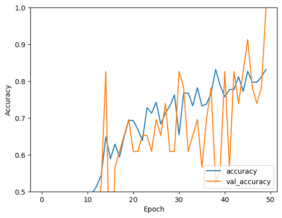
    


## Evaluate the CNN Model


```python
# Evaluate the model.
score = model.evaluate(X_test, y_test, verbose=0, batch_size = 50)
print('Test loss:', score[0])
print('Test accuracy:', score[1])
```

    Test loss: 0.4502786099910736
    Test accuracy: 0.8461538553237915


As we see from the model, its learning well and also fits properly - the accuracy score also looks good 

### Divide the training data into training and validation set from X_train


```python
from sklearn.model_selection import train_test_split
X_train, X_val, y_train, y_val = train_test_split(X_train,y_train , test_size=0.1, random_state=7,stratify=y_train)
```


```python
X_train.shape
```


    (202, 128, 128, 3)


## Tune the CNN model


```python
# Set the CNN model 
batch_size=50
model1 = Sequential()

model1.add(Conv2D(filters = 32, kernel_size = (5,5),padding = 'Same', 
                 activation ='relu', batch_input_shape = (batch_size,128, 128, 3)))


model1.add(Conv2D(filters = 32, kernel_size = (5,5),padding = 'Same', 
                 activation ='relu'))
model1.add(MaxPool2D(pool_size=(2,2)))
model1.add(Dropout(0.2))


model1.add(Conv2D(filters = 64, kernel_size = (3,3),padding = 'Same', 
                 activation ='relu'))
model1.add(Conv2D(filters = 64, kernel_size = (3,3),padding = 'same', 
                 activation ='relu'))
model1.add(MaxPool2D(pool_size=(2,2), strides=(2,2)))
model1.add(Dropout(0.3))

model1.add(Conv2D(filters = 128, kernel_size = (3,3),padding = 'Same', 
                 activation ='relu'))
model1.add(Conv2D(filters = 128, kernel_size = (3,3),padding = 'Same', 
                 activation ='relu'))
model1.add(MaxPool2D(pool_size=(2,2), strides=(2,2)))
model1.add(Dropout(0.4))


model1.add(GlobalMaxPooling2D())
model1.add(Dense(128, activation = "relu"))
model1.add(Dropout(0.5))
model1.add(Dense(3, activation = "softmax"))
model1.summary()
```

    Model: "sequential_1"
    _________________________________________________________________
     Layer (type)                Output Shape              Param #   
    =================================================================
     conv2d_6 (Conv2D)           (50, 128, 128, 32)        2432      
                                                                     
     conv2d_7 (Conv2D)           (50, 128, 128, 32)        25632     
                                                                     
     max_pooling2d_3 (MaxPoolin  (50, 64, 64, 32)          0         
     g2D)                                                            
                                                                     
     dropout_4 (Dropout)         (50, 64, 64, 32)          0         
                                                                     
     conv2d_8 (Conv2D)           (50, 64, 64, 64)          18496     
                                                                     
     conv2d_9 (Conv2D)           (50, 64, 64, 64)          36928     
                                                                     
     max_pooling2d_4 (MaxPoolin  (50, 32, 32, 64)          0         
     g2D)                                                            
                                                                     
     dropout_5 (Dropout)         (50, 32, 32, 64)          0         
                                                                     
     conv2d_10 (Conv2D)          (50, 32, 32, 128)         73856     
                                                                     
     conv2d_11 (Conv2D)          (50, 32, 32, 128)         147584    
                                                                     
     max_pooling2d_5 (MaxPoolin  (50, 16, 16, 128)         0         
     g2D)                                                            
                                                                     
     dropout_6 (Dropout)         (50, 16, 16, 128)         0         
                                                                     
     global_max_pooling2d_1 (Gl  (50, 128)                 0         
     obalMaxPooling2D)                                               
                                                                     
     dense_2 (Dense)             (50, 128)                 16512     
                                                                     
     dropout_7 (Dropout)         (50, 128)                 0         
                                                                     
     dense_3 (Dense)             (50, 3)                   387       
                                                                     
    =================================================================
    Total params: 321827 (1.23 MB)
    Trainable params: 321827 (1.23 MB)
    Non-trainable params: 0 (0.00 Byte)
    _________________________________________________________________


```python
from keras.callbacks import ReduceLROnPlateau

learning_rate_reduction = ReduceLROnPlateau(monitor='val_accuracy', 
                                            patience=3, 
                                            verbose=1, 
                                            factor=0.5, 
                                            min_lr=0.00001)
epochs = 50
batch_size = 50
```


```python
#Defining the optimizer and loss function 
optimizer = RMSprop(learning_rate=0.001, rho=0.9, epsilon=1e-08, weight_decay=0.0)
model1.compile(optimizer = optimizer, loss = "categorical_crossentropy", metrics = ["accuracy"])
```


```python
X_train.shape[0]
```


    202


```python
#Fitting the model using fit_generator function 
#X_train, X_val, y_train, y_test
batch_size = 50
#stepsPerEpoch=X_train.shape[0]//batch_size
#history = model.fit(X_train, y_train, epochs = 50, validation_split=0.1,batch_size = batch_size)
history1 = model1.fit(X_train,y_train, epochs = 50, validation_data = (X_val,y_val), batch_size = batch_size, verbose = 2, callbacks=[learning_rate_reduction])
```

    Epoch 1/50
    5/5 - 6s - loss: 1.1730 - accuracy: 0.3317 - val_loss: 1.0967 - val_accuracy: 0.4348 - lr: 0.0010 - 6s/epoch - 1s/step
    Epoch 2/50
    5/5 - 5s - loss: 1.0920 - accuracy: 0.4554 - val_loss: 1.0918 - val_accuracy: 0.4348 - lr: 0.0010 - 5s/epoch - 1s/step
    Epoch 3/50
    5/5 - 5s - loss: 1.0897 - accuracy: 0.4356 - val_loss: 1.0833 - val_accuracy: 0.4348 - lr: 0.0010 - 5s/epoch - 1s/step
    Epoch 4/50
    
    Epoch 4: ReduceLROnPlateau reducing learning rate to 0.0005000000237487257.
    5/5 - 5s - loss: 1.0276 - accuracy: 0.4406 - val_loss: 1.0938 - val_accuracy: 0.4348 - lr: 0.0010 - 5s/epoch - 1s/step
    Epoch 5/50
    5/5 - 5s - loss: 1.0859 - accuracy: 0.4158 - val_loss: 1.0846 - val_accuracy: 0.4348 - lr: 5.0000e-04 - 5s/epoch - 1s/step
    Epoch 6/50
    5/5 - 6s - loss: 1.0496 - accuracy: 0.4752 - val_loss: 1.0012 - val_accuracy: 0.4348 - lr: 5.0000e-04 - 6s/epoch - 1s/step
    Epoch 7/50
    
    Epoch 7: ReduceLROnPlateau reducing learning rate to 0.0002500000118743628.
    5/5 - 6s - loss: 0.9570 - accuracy: 0.4455 - val_loss: 0.9563 - val_accuracy: 0.4348 - lr: 5.0000e-04 - 6s/epoch - 1s/step
    Epoch 8/50
    5/5 - 5s - loss: 0.9085 - accuracy: 0.4802 - val_loss: 0.9542 - val_accuracy: 0.4348 - lr: 2.5000e-04 - 5s/epoch - 1s/step
    Epoch 9/50
    5/5 - 6s - loss: 0.9059 - accuracy: 0.4950 - val_loss: 0.9538 - val_accuracy: 0.5217 - lr: 2.5000e-04 - 6s/epoch - 1s/step
    Epoch 10/50
    5/5 - 5s - loss: 0.8770 - accuracy: 0.5396 - val_loss: 0.9179 - val_accuracy: 0.4348 - lr: 2.5000e-04 - 5s/epoch - 1s/step
    Epoch 11/50
    5/5 - 5s - loss: 0.8179 - accuracy: 0.5743 - val_loss: 1.0313 - val_accuracy: 0.5217 - lr: 2.5000e-04 - 5s/epoch - 1s/step
    Epoch 12/50
    5/5 - 6s - loss: 0.8451 - accuracy: 0.5792 - val_loss: 0.8711 - val_accuracy: 0.6957 - lr: 2.5000e-04 - 6s/epoch - 1s/step
    Epoch 13/50
    5/5 - 6s - loss: 0.7550 - accuracy: 0.5990 - val_loss: 0.9627 - val_accuracy: 0.5217 - lr: 2.5000e-04 - 6s/epoch - 1s/step
    Epoch 14/50
    5/5 - 6s - loss: 0.7916 - accuracy: 0.6584 - val_loss: 0.8595 - val_accuracy: 0.6087 - lr: 2.5000e-04 - 6s/epoch - 1s/step
    Epoch 15/50
    
    Epoch 15: ReduceLROnPlateau reducing learning rate to 0.0001250000059371814.
    5/5 - 6s - loss: 0.7353 - accuracy: 0.6436 - val_loss: 0.7854 - val_accuracy: 0.5217 - lr: 2.5000e-04 - 6s/epoch - 1s/step
    Epoch 16/50
    5/5 - 6s - loss: 0.6864 - accuracy: 0.7327 - val_loss: 0.7761 - val_accuracy: 0.6087 - lr: 1.2500e-04 - 6s/epoch - 1s/step
    Epoch 17/50
    5/5 - 5s - loss: 0.7109 - accuracy: 0.6733 - val_loss: 0.8145 - val_accuracy: 0.6957 - lr: 1.2500e-04 - 5s/epoch - 1s/step
    Epoch 18/50
    
    Epoch 18: ReduceLROnPlateau reducing learning rate to 6.25000029685907e-05.
    5/5 - 5s - loss: 0.6748 - accuracy: 0.6782 - val_loss: 0.7620 - val_accuracy: 0.5217 - lr: 1.2500e-04 - 5s/epoch - 1s/step
    Epoch 19/50
    5/5 - 6s - loss: 0.6987 - accuracy: 0.6733 - val_loss: 0.7430 - val_accuracy: 0.6087 - lr: 6.2500e-05 - 6s/epoch - 1s/step
    Epoch 20/50
    5/5 - 6s - loss: 0.6762 - accuracy: 0.6931 - val_loss: 0.7445 - val_accuracy: 0.6957 - lr: 6.2500e-05 - 6s/epoch - 1s/step
    Epoch 21/50
    5/5 - 6s - loss: 0.6662 - accuracy: 0.6832 - val_loss: 0.7610 - val_accuracy: 0.7391 - lr: 6.2500e-05 - 6s/epoch - 1s/step
    Epoch 22/50
    5/5 - 6s - loss: 0.6727 - accuracy: 0.7030 - val_loss: 0.7417 - val_accuracy: 0.6087 - lr: 6.2500e-05 - 6s/epoch - 1s/step
    Epoch 23/50
    5/5 - 6s - loss: 0.6590 - accuracy: 0.7129 - val_loss: 0.7546 - val_accuracy: 0.5652 - lr: 6.2500e-05 - 6s/epoch - 1s/step
    Epoch 24/50
    
    Epoch 24: ReduceLROnPlateau reducing learning rate to 3.125000148429535e-05.
    5/5 - 6s - loss: 0.6641 - accuracy: 0.6832 - val_loss: 0.7302 - val_accuracy: 0.6087 - lr: 6.2500e-05 - 6s/epoch - 1s/step
    Epoch 25/50
    5/5 - 6s - loss: 0.6405 - accuracy: 0.7079 - val_loss: 0.7290 - val_accuracy: 0.6087 - lr: 3.1250e-05 - 6s/epoch - 1s/step
    Epoch 26/50
    5/5 - 6s - loss: 0.6554 - accuracy: 0.7277 - val_loss: 0.7294 - val_accuracy: 0.6087 - lr: 3.1250e-05 - 6s/epoch - 1s/step
    Epoch 27/50
    
    Epoch 27: ReduceLROnPlateau reducing learning rate to 1.5625000742147677e-05.
    5/5 - 6s - loss: 0.6826 - accuracy: 0.6485 - val_loss: 0.7275 - val_accuracy: 0.6957 - lr: 3.1250e-05 - 6s/epoch - 1s/step
    Epoch 28/50
    5/5 - 6s - loss: 0.6807 - accuracy: 0.6782 - val_loss: 0.7278 - val_accuracy: 0.6087 - lr: 1.5625e-05 - 6s/epoch - 1s/step
    Epoch 29/50
    5/5 - 6s - loss: 0.6645 - accuracy: 0.7079 - val_loss: 0.7256 - val_accuracy: 0.6087 - lr: 1.5625e-05 - 6s/epoch - 1s/step
    Epoch 30/50
    
    Epoch 30: ReduceLROnPlateau reducing learning rate to 1e-05.
    5/5 - 6s - loss: 0.6563 - accuracy: 0.7129 - val_loss: 0.7276 - val_accuracy: 0.6087 - lr: 1.5625e-05 - 6s/epoch - 1s/step
    Epoch 31/50
    5/5 - 6s - loss: 0.6356 - accuracy: 0.6931 - val_loss: 0.7274 - val_accuracy: 0.6087 - lr: 1.0000e-05 - 6s/epoch - 1s/step
    Epoch 32/50
    5/5 - 6s - loss: 0.6850 - accuracy: 0.7277 - val_loss: 0.7292 - val_accuracy: 0.6087 - lr: 1.0000e-05 - 6s/epoch - 1s/step
    Epoch 33/50
    5/5 - 6s - loss: 0.6812 - accuracy: 0.6832 - val_loss: 0.7307 - val_accuracy: 0.6087 - lr: 1.0000e-05 - 6s/epoch - 1s/step
    Epoch 34/50
    5/5 - 6s - loss: 0.6643 - accuracy: 0.6782 - val_loss: 0.7304 - val_accuracy: 0.6087 - lr: 1.0000e-05 - 6s/epoch - 1s/step
    Epoch 35/50
    5/5 - 6s - loss: 0.6532 - accuracy: 0.7079 - val_loss: 0.7262 - val_accuracy: 0.6087 - lr: 1.0000e-05 - 6s/epoch - 1s/step
    Epoch 36/50
    5/5 - 6s - loss: 0.6910 - accuracy: 0.6485 - val_loss: 0.7251 - val_accuracy: 0.6087 - lr: 1.0000e-05 - 6s/epoch - 1s/step
    Epoch 37/50
    5/5 - 6s - loss: 0.6601 - accuracy: 0.6980 - val_loss: 0.7264 - val_accuracy: 0.6087 - lr: 1.0000e-05 - 6s/epoch - 1s/step
    Epoch 38/50
    5/5 - 6s - loss: 0.6611 - accuracy: 0.7327 - val_loss: 0.7240 - val_accuracy: 0.6087 - lr: 1.0000e-05 - 6s/epoch - 1s/step
    Epoch 39/50
    5/5 - 6s - loss: 0.6423 - accuracy: 0.6980 - val_loss: 0.7251 - val_accuracy: 0.6087 - lr: 1.0000e-05 - 6s/epoch - 1s/step
    Epoch 40/50
    5/5 - 6s - loss: 0.6780 - accuracy: 0.7030 - val_loss: 0.7259 - val_accuracy: 0.6087 - lr: 1.0000e-05 - 6s/epoch - 1s/step
    Epoch 41/50
    5/5 - 6s - loss: 0.6435 - accuracy: 0.7030 - val_loss: 0.7249 - val_accuracy: 0.6087 - lr: 1.0000e-05 - 6s/epoch - 1s/step
    Epoch 42/50
    5/5 - 6s - loss: 0.6474 - accuracy: 0.6980 - val_loss: 0.7283 - val_accuracy: 0.6087 - lr: 1.0000e-05 - 6s/epoch - 1s/step
    Epoch 43/50
    5/5 - 6s - loss: 0.6283 - accuracy: 0.7079 - val_loss: 0.7307 - val_accuracy: 0.6087 - lr: 1.0000e-05 - 6s/epoch - 1s/step
    Epoch 44/50
    5/5 - 6s - loss: 0.6640 - accuracy: 0.6535 - val_loss: 0.7345 - val_accuracy: 0.5652 - lr: 1.0000e-05 - 6s/epoch - 1s/step
    Epoch 45/50
    5/5 - 6s - loss: 0.6772 - accuracy: 0.6584 - val_loss: 0.7321 - val_accuracy: 0.5652 - lr: 1.0000e-05 - 6s/epoch - 1s/step
    Epoch 46/50
    5/5 - 6s - loss: 0.6753 - accuracy: 0.6832 - val_loss: 0.7289 - val_accuracy: 0.6087 - lr: 1.0000e-05 - 6s/epoch - 1s/step
    Epoch 47/50
    5/5 - 6s - loss: 0.6527 - accuracy: 0.7376 - val_loss: 0.7271 - val_accuracy: 0.6087 - lr: 1.0000e-05 - 6s/epoch - 1s/step
    Epoch 48/50
    5/5 - 6s - loss: 0.6569 - accuracy: 0.6782 - val_loss: 0.7257 - val_accuracy: 0.6087 - lr: 1.0000e-05 - 6s/epoch - 1s/step
    Epoch 49/50
    5/5 - 6s - loss: 0.6464 - accuracy: 0.6931 - val_loss: 0.7200 - val_accuracy: 0.6087 - lr: 1.0000e-05 - 6s/epoch - 1s/step
    Epoch 50/50
    5/5 - 6s - loss: 0.6482 - accuracy: 0.6980 - val_loss: 0.7205 - val_accuracy: 0.6087 - lr: 1.0000e-05 - 6s/epoch - 1s/step


```python
plt.plot(history1.history['accuracy'], label='accuracy')
plt.plot(history1.history['val_accuracy'], label = 'val_accuracy')
plt.xlabel('Epoch')
plt.ylabel('Accuracy')
plt.ylim([0.3, 1])
plt.legend(loc='lower right');
```


    
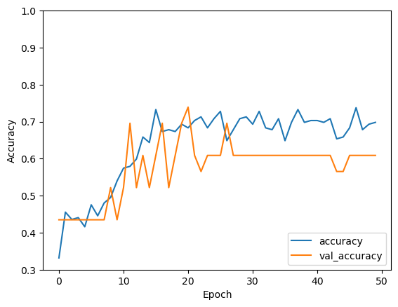
    


## Evaluate the tuned CNN model


```python
# Evaluate the model.

score = model1.evaluate(X_test, y_test, verbose=0)
print('Test loss:', score[0])
print('Test accuracy:', score[1])
```

    Test loss: 0.7593666911125183
    Test accuracy: 0.692307710647583


### The accuracy has actually gone down with the changing learning rate - Let's use the first model

### Plot the confusion matrix for first model


```python
# Predict the values from the validation dataset
Y_pred = model.predict(X_test)
# Convert predictions classes to one hot vectors 
result = np.argmax(Y_pred, axis=1)
# Convert validation observations to one hot vectors
Y_true = np.argmax(y_test, axis=1)

import matplotlib.pyplot as plt
import seaborn as sns
from sklearn.metrics import confusion_matrix

conf_mat = confusion_matrix(Y_true, result)

df_cm = pd.DataFrame(conf_mat, index = [i for i in range(0, 3)],
                  columns = [i for i in range(0, 3)])
plt.figure(figsize = (10,7))
sns.heatmap(df_cm, annot=True, fmt='g');
```

    1/1 [==============================] - 0s 171ms/step


    
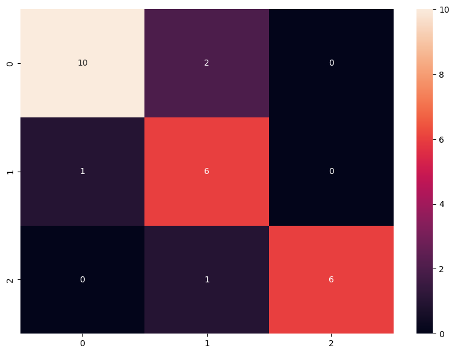
    


### Plot the confusion matrix for tuned model


```python
# Predict the values from the validation dataset
Y_pred = model1.predict(X_test)
# Convert predictions classes to one hot vectors 
result = np.argmax(Y_pred, axis=1)
# Convert validation observations to one hot vectors
Y_true = np.argmax(y_test, axis=1)

import matplotlib.pyplot as plt
import seaborn as sns
from sklearn.metrics import confusion_matrix

conf_mat = confusion_matrix(Y_true, result)

df_cm = pd.DataFrame(conf_mat, index = [i for i in range(0, 3)],
                  columns = [i for i in range(0, 3)])
plt.figure(figsize = (10,7))
sns.heatmap(df_cm, annot=True, fmt='g');
```

    1/1 [==============================] - 0s 172ms/step


    
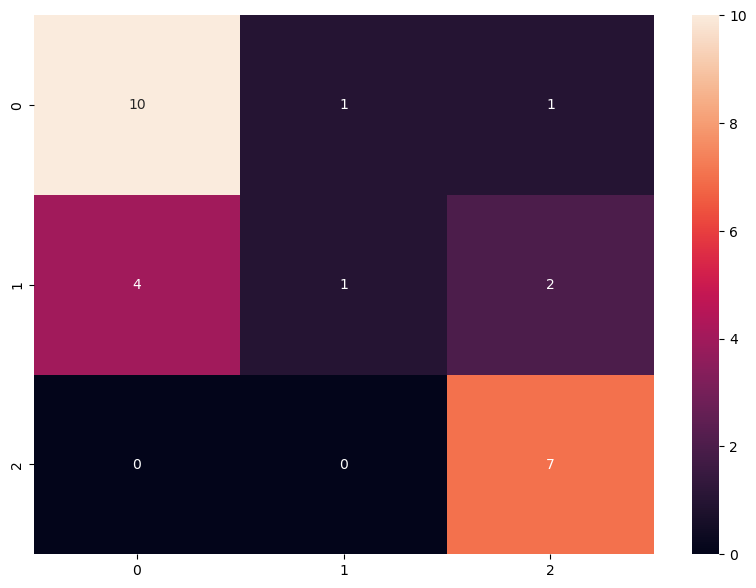
    


## Visualize the Prediction with first model


```python
import numpy as np

plt.figure(figsize=(2,2))
plt.imshow(X_test[3],cmap="gray")
plt.show()
print('Predicted Label', np.argmax(model.predict(X_test[3].reshape(1,128,128,3))))
print('True Label', np.argmax(y_test[3]))

plt.figure(figsize=(2,2))
plt.imshow(X_test[2],cmap="gray")
plt.show()
print('Predicted Label', np.argmax(model.predict(X_test[2].reshape(1,128,128,3))))
print('True Label', np.argmax(y_test[2]))

plt.figure(figsize=(2,2))
plt.imshow(X_test[16],cmap="gray")
plt.show()
print('Predicted Label', np.argmax(model.predict(X_test[16].reshape(1,128,128,3))))
print('True Label', np.argmax(y_test[16]))

plt.figure(figsize=(2,2))
plt.imshow(X_test[20],cmap="gray")
plt.show()
print('Predicted Label', np.argmax(model.predict(X_test[20].reshape(1,128,128,3))))
print('True Label', np.argmax(y_test[20]))

plt.figure(figsize=(2,2))
plt.imshow(X_test[25],cmap="gray")
plt.show()
print('Predicted Label', np.argmax(model.predict(X_test[25].reshape(1,128,128,3))))
print('True Label', np.argmax(y_test[25]))
```


    
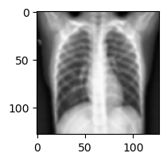
    


    1/1 [==============================] - 0s 14ms/step
    Predicted Label 1
    True Label 1


    
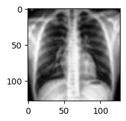
    


    1/1 [==============================] - 0s 15ms/step
    Predicted Label 0
    True Label 1


    
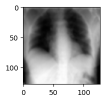
    


    1/1 [==============================] - 0s 15ms/step
    Predicted Label 0
    True Label 0


    
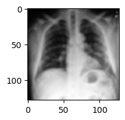
    


    1/1 [==============================] - 0s 14ms/step
    Predicted Label 0
    True Label 0


    
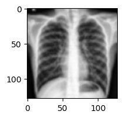
    


    1/1 [==============================] - 0s 14ms/step
    Predicted Label 1
    True Label 1


## Visualize the Prediction with tuned model


```python
import numpy as np

plt.figure(figsize=(2,2))
plt.imshow(X_test[3],cmap="gray")
plt.show()
print('Predicted Label', np.argmax(model1.predict(X_test[3].reshape(1,128,128,3))))
print('True Label', np.argmax(y_test[3]))

plt.figure(figsize=(2,2))
plt.imshow(X_test[2],cmap="gray")
plt.show()
print('Predicted Label', np.argmax(model1.predict(X_test[2].reshape(1,128,128,3))))
print('True Label', np.argmax(y_test[2]))

plt.figure(figsize=(2,2))
plt.imshow(X_test[16],cmap="gray")
plt.show()
print('Predicted Label', np.argmax(model1.predict(X_test[16].reshape(1,128,128,3))))
print('True Label', np.argmax(y_test[16]))

plt.figure(figsize=(2,2))
plt.imshow(X_test[20],cmap="gray")
plt.show()
print('Predicted Label', np.argmax(model1.predict(X_test[20].reshape(1,128,128,3))))
print('True Label', np.argmax(y_test[20]))

plt.figure(figsize=(2,2))
plt.imshow(X_test[25],cmap="gray")
plt.show()
print('Predicted Label', np.argmax(model1.predict(X_test[25].reshape(1,128,128,3))))
print('True Label', np.argmax(y_test[25]))
```


    

    


    1/1 [==============================] - 0s 14ms/step
    Predicted Label 2
    True Label 1


    

    


    1/1 [==============================] - 0s 15ms/step
    Predicted Label 0
    True Label 1


    

    


    1/1 [==============================] - 0s 14ms/step
    Predicted Label 0
    True Label 0


    

    


    1/1 [==============================] - 0s 14ms/step
    Predicted Label 2
    True Label 0


    

    


    1/1 [==============================] - 0s 15ms/step
    Predicted Label 0
    True Label 1


## Observations
As seen above, the first model performed really well but the tuned model didn't meet the expectations, may be the tuning parameters were incorrect and needs further iterations to improve 


```python

```
