# Twitter Sentiment Analysis

## Launch a Jupyter Notebook
Let's launch a Jupyter notebook **twittermgmt** as shown below and also ensure that we have sufficient CPU cores to run some of the algorithms. I had to increase the minimum CPU count to 4 and maximum count to 8. Also the memory for this pod had to be increased from minimum 2Gi to maximum 4Gi


Once the notebook pod comes up, please click on the CONNECT link to launch a new tab for the notebook as shown below. Here we should be able to write the code for python and also upload any test data as required


**`Now, let's look at the actual problem at hand to see if it runs on our localhost`**

## Problem Statement

Twitter possesses 330 million monthly active users, which allows businesses to reach a broad population and connect with customers without intermediaries. On the other hand, there’s so much information that it’s difficult for brands to quickly detect negative social mentions that could harm their business.

That's why sentiment analysis/classification, which involves monitoring emotions in conversations on social media platforms, has become a key strategy in social media marketing.


Listening to how customers feel about the product/service on Twitter allows companies to understand their audience, keep on top of what’s being said about their brand and their competitors, and discover new trends in the industry.

## Data Description

A sentiment analysis job about the problems of each major U.S. airline. Twitter data was scraped from February of 2015 and contributors were asked to first classify positive, negative, and neutral tweets, followed by categorizing negative reasons (such as "late flight" or "rude service").


The dataset has the following columns:

* tweet_id                                                           
* airline_sentiment                                               
* airline_sentiment_confidence                               
* negativereason                                                   
* negativereason_confidence                                    
* airline                                                                    
* airline_sentiment_gold                                              
* name     
* negativereason_gold
* retweet_count
* text
* tweet_coord
* tweet_created
* tweet_location 
* user_timezone


Let's get the nltk and wordcloud packages installed onto this pod. The nltk also provides the wordnet and stopwords which are needed to be downloaded as zips

```python
pip install -U nltk
```

    Requirement already satisfied: nltk in /opt/conda/lib/python3.8/site-packages (3.8.1)
    Requirement already satisfied: click in /opt/conda/lib/python3.8/site-packages (from nltk) (7.1.2)
    Requirement already satisfied: joblib in /opt/conda/lib/python3.8/site-packages (from nltk) (1.3.2)
    Requirement already satisfied: regex>=2021.8.3 in /opt/conda/lib/python3.8/site-packages (from nltk) (2023.12.25)
    Requirement already satisfied: tqdm in /opt/conda/lib/python3.8/site-packages (from nltk) (4.66.1)
    Note: you may need to restart the kernel to use updated packages.


```python
pip install -U wordcloud
```

    Requirement already satisfied: wordcloud in /opt/conda/lib/python3.8/site-packages (1.9.3)
    Requirement already satisfied: numpy>=1.6.1 in /opt/conda/lib/python3.8/site-packages (from wordcloud) (1.22.4)
    Requirement already satisfied: pillow in /opt/conda/lib/python3.8/site-packages (from wordcloud) (10.0.0)
    Requirement already satisfied: matplotlib in /opt/conda/lib/python3.8/site-packages (from wordcloud) (3.4.2)
    Requirement already satisfied: cycler>=0.10 in /opt/conda/lib/python3.8/site-packages (from matplotlib->wordcloud) (0.11.0)
    Requirement already satisfied: kiwisolver>=1.0.1 in /opt/conda/lib/python3.8/site-packages (from matplotlib->wordcloud) (1.4.5)
    Requirement already satisfied: pyparsing>=2.2.1 in /opt/conda/lib/python3.8/site-packages (from matplotlib->wordcloud) (3.1.1)
    Requirement already satisfied: python-dateutil>=2.7 in /opt/conda/lib/python3.8/site-packages (from matplotlib->wordcloud) (2.8.2)
    Requirement already satisfied: six>=1.5 in /opt/conda/lib/python3.8/site-packages (from python-dateutil>=2.7->matplotlib->wordcloud) (1.16.0)
    Note: you may need to restart the kernel to use updated packages.


```python
import nltk
nltk.download('wordnet')
nltk.download('stopwords')
```

    [nltk_data] Downloading package wordnet to /home/jovyan/nltk_data...
    [nltk_data]   Package wordnet is already up-to-date!
    [nltk_data] Downloading package stopwords to /home/jovyan/nltk_data...
    [nltk_data]   Package stopwords is already up-to-date!


    True


### Importing the Libraries


```python
import re
import numpy as np                                  #for large and multi-dimensional arrays
import pandas as pd                                 #for data manipulation and analysis
import nltk                                         #Natural language processing tool-kit

nltk.download('stopwords')    #download stopwords
nltk.download('punkt')

from nltk.corpus import stopwords                   #Stopwords corpus
from nltk.stem import PorterStemmer                 # Stemmer
from nltk.tokenize import word_tokenize 

from sklearn.feature_extraction.text import CountVectorizer          #For Bag of words
from sklearn.feature_extraction.text import TfidfVectorizer          #For TF-IDF

!pip install vaderSentiment    # Install vader sentiment package
!pip install textblob   # Install textblob package

# install and import necessary libraries.

!pip install contractions

import re, string, unicodedata                          # Import Regex, string and unicodedata.
import contractions                                     # Import contractions library.
from bs4 import BeautifulSoup                           # Import BeautifulSoup.

import numpy as np                                      # Import numpy.
import pandas as pd                                     # Import pandas.
import nltk                                             # Import Natural Language Tool-Kit.

from nltk.corpus import stopwords                       # Import stopwords.
from nltk.tokenize import word_tokenize, sent_tokenize  # Import Tokenizer.
from nltk.stem.wordnet import WordNetLemmatizer         # Import Lemmatizer.
import matplotlib.pyplot as plt   
from sklearn.model_selection import KFold , StratifiedKFold, cross_val_score
from sklearn.metrics import accuracy_score
import seaborn as sns


from sklearn.ensemble import RandomForestClassifier       # Import Random forest Classifier
from sklearn.metrics import classification_report         # Import Classification report
from sklearn.model_selection import cross_val_score  
```

    [nltk_data] Downloading package stopwords to /home/jovyan/nltk_data...
    [nltk_data]   Package stopwords is already up-to-date!
    [nltk_data] Downloading package punkt to /home/jovyan/nltk_data...
    [nltk_data]   Package punkt is already up-to-date!


    Requirement already satisfied: vaderSentiment in /opt/conda/lib/python3.8/site-packages (3.3.2)
    Requirement already satisfied: requests in /opt/conda/lib/python3.8/site-packages (from vaderSentiment) (2.31.0)
    Requirement already satisfied: charset-normalizer<4,>=2 in /opt/conda/lib/python3.8/site-packages (from requests->vaderSentiment) (3.2.0)
    Requirement already satisfied: idna<4,>=2.5 in /opt/conda/lib/python3.8/site-packages (from requests->vaderSentiment) (3.4)
    Requirement already satisfied: urllib3<3,>=1.21.1 in /opt/conda/lib/python3.8/site-packages (from requests->vaderSentiment) (2.0.4)
    Requirement already satisfied: certifi>=2017.4.17 in /opt/conda/lib/python3.8/site-packages (from requests->vaderSentiment) (2023.7.22)
    Requirement already satisfied: textblob in /opt/conda/lib/python3.8/site-packages (0.18.0.post0)
    Requirement already satisfied: nltk>=3.8 in /opt/conda/lib/python3.8/site-packages (from textblob) (3.8.1)
    Requirement already satisfied: click in /opt/conda/lib/python3.8/site-packages (from nltk>=3.8->textblob) (7.1.2)
    Requirement already satisfied: joblib in /opt/conda/lib/python3.8/site-packages (from nltk>=3.8->textblob) (1.3.2)
    Requirement already satisfied: regex>=2021.8.3 in /opt/conda/lib/python3.8/site-packages (from nltk>=3.8->textblob) (2023.12.25)
    Requirement already satisfied: tqdm in /opt/conda/lib/python3.8/site-packages (from nltk>=3.8->textblob) (4.66.1)
    Requirement already satisfied: contractions in /opt/conda/lib/python3.8/site-packages (0.1.73)
    Requirement already satisfied: textsearch>=0.0.21 in /opt/conda/lib/python3.8/site-packages (from contractions) (0.0.24)
    Requirement already satisfied: anyascii in /opt/conda/lib/python3.8/site-packages (from textsearch>=0.0.21->contractions) (0.3.2)
    Requirement already satisfied: pyahocorasick in /opt/conda/lib/python3.8/site-packages (from textsearch>=0.0.21->contractions) (2.1.0)


```python
# Loading data into pandas dataframe
data = pd.read_csv("Tweets.csv")
```


```python
data.head()
```


<div>
<style scoped>
    .dataframe tbody tr th:only-of-type {
        vertical-align: middle;
    }

    .dataframe tbody tr th {
        vertical-align: top;
    }

    .dataframe thead th {
        text-align: right;
    }
</style>
<table border="1" class="dataframe">
  <thead>
    <tr style="text-align: right;">
      <th></th>
      <th>tweet_id</th>
      <th>airline_sentiment</th>
      <th>airline_sentiment_confidence</th>
      <th>negativereason</th>
      <th>negativereason_confidence</th>
      <th>airline</th>
      <th>airline_sentiment_gold</th>
      <th>name</th>
      <th>negativereason_gold</th>
      <th>retweet_count</th>
      <th>text</th>
      <th>tweet_coord</th>
      <th>tweet_created</th>
      <th>tweet_location</th>
      <th>user_timezone</th>
    </tr>
  </thead>
  <tbody>
    <tr>
      <th>0</th>
      <td>570306133677760513</td>
      <td>neutral</td>
      <td>1.0000</td>
      <td>NaN</td>
      <td>NaN</td>
      <td>Virgin America</td>
      <td>NaN</td>
      <td>cairdin</td>
      <td>NaN</td>
      <td>0</td>
      <td>@VirginAmerica What @dhepburn said.</td>
      <td>NaN</td>
      <td>2015-02-24 11:35:52 -0800</td>
      <td>NaN</td>
      <td>Eastern Time (US &amp; Canada)</td>
    </tr>
    <tr>
      <th>1</th>
      <td>570301130888122368</td>
      <td>positive</td>
      <td>0.3486</td>
      <td>NaN</td>
      <td>0.0000</td>
      <td>Virgin America</td>
      <td>NaN</td>
      <td>jnardino</td>
      <td>NaN</td>
      <td>0</td>
      <td>@VirginAmerica plus you've added commercials t...</td>
      <td>NaN</td>
      <td>2015-02-24 11:15:59 -0800</td>
      <td>NaN</td>
      <td>Pacific Time (US &amp; Canada)</td>
    </tr>
    <tr>
      <th>2</th>
      <td>570301083672813571</td>
      <td>neutral</td>
      <td>0.6837</td>
      <td>NaN</td>
      <td>NaN</td>
      <td>Virgin America</td>
      <td>NaN</td>
      <td>yvonnalynn</td>
      <td>NaN</td>
      <td>0</td>
      <td>@VirginAmerica I didn't today... Must mean I n...</td>
      <td>NaN</td>
      <td>2015-02-24 11:15:48 -0800</td>
      <td>Lets Play</td>
      <td>Central Time (US &amp; Canada)</td>
    </tr>
    <tr>
      <th>3</th>
      <td>570301031407624196</td>
      <td>negative</td>
      <td>1.0000</td>
      <td>Bad Flight</td>
      <td>0.7033</td>
      <td>Virgin America</td>
      <td>NaN</td>
      <td>jnardino</td>
      <td>NaN</td>
      <td>0</td>
      <td>@VirginAmerica it's really aggressive to blast...</td>
      <td>NaN</td>
      <td>2015-02-24 11:15:36 -0800</td>
      <td>NaN</td>
      <td>Pacific Time (US &amp; Canada)</td>
    </tr>
    <tr>
      <th>4</th>
      <td>570300817074462722</td>
      <td>negative</td>
      <td>1.0000</td>
      <td>Can't Tell</td>
      <td>1.0000</td>
      <td>Virgin America</td>
      <td>NaN</td>
      <td>jnardino</td>
      <td>NaN</td>
      <td>0</td>
      <td>@VirginAmerica and it's a really big bad thing...</td>
      <td>NaN</td>
      <td>2015-02-24 11:14:45 -0800</td>
      <td>NaN</td>
      <td>Pacific Time (US &amp; Canada)</td>
    </tr>
  </tbody>
</table>
</div>


## Exploratory Data Analysis


```python
data.shape
```


    (14640, 15)


```python
data.info()
```

    <class 'pandas.core.frame.DataFrame'>
    RangeIndex: 14640 entries, 0 to 14639
    Data columns (total 15 columns):
     #   Column                        Non-Null Count  Dtype  
    ---  ------                        --------------  -----  
     0   tweet_id                      14640 non-null  int64  
     1   airline_sentiment             14640 non-null  object 
     2   airline_sentiment_confidence  14640 non-null  float64
     3   negativereason                9178 non-null   object 
     4   negativereason_confidence     10522 non-null  float64
     5   airline                       14640 non-null  object 
     6   airline_sentiment_gold        40 non-null     object 
     7   name                          14640 non-null  object 
     8   negativereason_gold           32 non-null     object 
     9   retweet_count                 14640 non-null  int64  
     10  text                          14640 non-null  object 
     11  tweet_coord                   1019 non-null   object 
     12  tweet_created                 14640 non-null  object 
     13  tweet_location                9907 non-null   object 
     14  user_timezone                 9820 non-null   object 
    dtypes: float64(2), int64(2), object(11)
    memory usage: 1.7+ MB


```python
data.isnull().sum(axis=0)          # Check for NULL values.
```


    tweet_id                            0
    airline_sentiment                   0
    airline_sentiment_confidence        0
    negativereason                   5462
    negativereason_confidence        4118
    airline                             0
    airline_sentiment_gold          14600
    name                                0
    negativereason_gold             14608
    retweet_count                       0
    text                                0
    tweet_coord                     13621
    tweet_created                       0
    tweet_location                   4733
    user_timezone                    4820
    dtype: int64


### Visualization of missing values using heatmap


```python
plt.figure(figsize=(8,6))
sns.heatmap(data.isnull())                                  #Visualization of missing value using heatmap
plt.title("Missing values?", fontsize = 15)
plt.show()
```


    
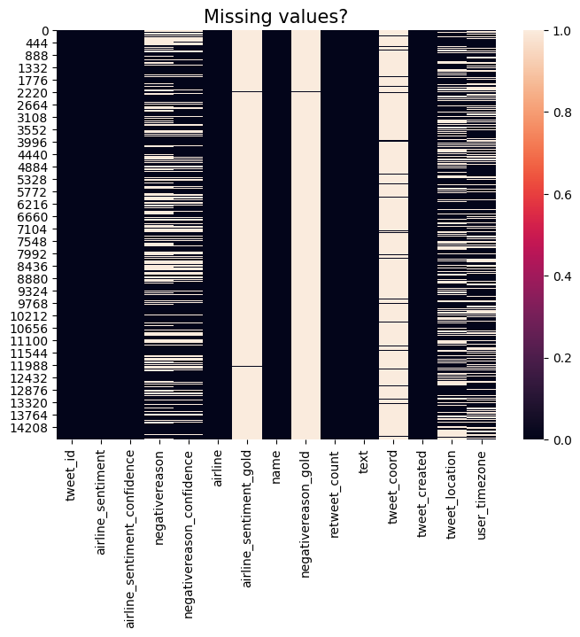
    


### This method from the course material gives a detailed view of missing values with the percentages 


```python
def missing_zero_values_table(df):
        zero_val = (df == 0.00).astype(int).sum(axis=0)                                            # Nu of zero in each column
        mis_val = df.isnull().sum()                                                                #Missing value in each column
        mis_val_percent = 100 * df.isnull().sum() / len(df)                                        #Missing value percent accross column
        mz_table = pd.concat([zero_val, mis_val, mis_val_percent], axis=1)                         #Concatenation of above aoutput
        mz_table = mz_table.rename(
        columns = {0 : 'Zero Values', 1 : 'Missing Values', 2 : '% of Total Values'})               #Renaming of each coumn
        mz_table['Total Zero Missing Values'] = mz_table['Zero Values'] + mz_table['Missing Values']  #column having total of zero value and missing values
        mz_table['% Total Zero Missing Values'] = 100 * mz_table['Total Zero Missing Values'] / len(df) # Column having percentage of totalof zero and missing value
        mz_table['Data Type'] = df.dtypes
        mz_table = mz_table[
            mz_table.iloc[:,1] != 0].sort_values(                                                     #Selecting and sorting those column which have at not a zero value in % of Total Values column
        '% of Total Values', ascending=False).round(1)
        print ("Your selected dataframe has " + str(df.shape[1]) + " columns and " + str(df.shape[0]) + " Rows.\n"      
            "There are " + str(mz_table.shape[0]) +
              " columns that have missing values.")
        return mz_table

missing_zero_values_table(data)
```

    Your selected dataframe has 15 columns and 14640 Rows.
    There are 7 columns that have missing values.


<div>
<style scoped>
    .dataframe tbody tr th:only-of-type {
        vertical-align: middle;
    }

    .dataframe tbody tr th {
        vertical-align: top;
    }

    .dataframe thead th {
        text-align: right;
    }
</style>
<table border="1" class="dataframe">
  <thead>
    <tr style="text-align: right;">
      <th></th>
      <th>Zero Values</th>
      <th>Missing Values</th>
      <th>% of Total Values</th>
      <th>Total Zero Missing Values</th>
      <th>% Total Zero Missing Values</th>
      <th>Data Type</th>
    </tr>
  </thead>
  <tbody>
    <tr>
      <th>negativereason_gold</th>
      <td>0</td>
      <td>14608</td>
      <td>99.8</td>
      <td>14608</td>
      <td>99.8</td>
      <td>object</td>
    </tr>
    <tr>
      <th>airline_sentiment_gold</th>
      <td>0</td>
      <td>14600</td>
      <td>99.7</td>
      <td>14600</td>
      <td>99.7</td>
      <td>object</td>
    </tr>
    <tr>
      <th>tweet_coord</th>
      <td>0</td>
      <td>13621</td>
      <td>93.0</td>
      <td>13621</td>
      <td>93.0</td>
      <td>object</td>
    </tr>
    <tr>
      <th>negativereason</th>
      <td>0</td>
      <td>5462</td>
      <td>37.3</td>
      <td>5462</td>
      <td>37.3</td>
      <td>object</td>
    </tr>
    <tr>
      <th>user_timezone</th>
      <td>0</td>
      <td>4820</td>
      <td>32.9</td>
      <td>4820</td>
      <td>32.9</td>
      <td>object</td>
    </tr>
    <tr>
      <th>tweet_location</th>
      <td>0</td>
      <td>4733</td>
      <td>32.3</td>
      <td>4733</td>
      <td>32.3</td>
      <td>object</td>
    </tr>
    <tr>
      <th>negativereason_confidence</th>
      <td>1344</td>
      <td>4118</td>
      <td>28.1</td>
      <td>5462</td>
      <td>37.3</td>
      <td>float64</td>
    </tr>
  </tbody>
</table>
</div>


### Observations on missing values
* negativereason_gold has 99.8 % missing valuess
* airline_sentiment_gold has 99.7 % missing values
* tweet_coord has 93% missing values

### Drop the columns that have high percentage of missing values


```python
#Drop the column which have got too many missing values or does not relevent information
data.drop(['negativereason_gold', 'tweet_id','airline_sentiment_gold','tweet_coord'],axis=1,inplace=True)
data.shape
```


    (14640, 11)


### Convert the date field into multiple columns for better analysis


```python
year=[]
month=[]
date=[]
hour=[]
for x in data['tweet_created']:
    year.append(int(x.split("-")[0]))                                          #extraction of year from date column and appending into list
    month.append(int(x.split("-")[1]))                                         #extraction of month from date column and appending into list
    date.append(int(x.split("-")[2].split(" ")[0]))                            #extraction of date of the month from date column and appending into list
    hour.append(int(x.split("-")[2].split(" ")[1].split(":")[0]))              #extraction of hour of that day from date column and appending into list

data['year']=year
data['month']=month
data['dates']=date
data['hour']=hour
data.head()
```


<div>
<style scoped>
    .dataframe tbody tr th:only-of-type {
        vertical-align: middle;
    }

    .dataframe tbody tr th {
        vertical-align: top;
    }

    .dataframe thead th {
        text-align: right;
    }
</style>
<table border="1" class="dataframe">
  <thead>
    <tr style="text-align: right;">
      <th></th>
      <th>airline_sentiment</th>
      <th>airline_sentiment_confidence</th>
      <th>negativereason</th>
      <th>negativereason_confidence</th>
      <th>airline</th>
      <th>name</th>
      <th>retweet_count</th>
      <th>text</th>
      <th>tweet_created</th>
      <th>tweet_location</th>
      <th>user_timezone</th>
      <th>year</th>
      <th>month</th>
      <th>dates</th>
      <th>hour</th>
    </tr>
  </thead>
  <tbody>
    <tr>
      <th>0</th>
      <td>neutral</td>
      <td>1.0000</td>
      <td>NaN</td>
      <td>NaN</td>
      <td>Virgin America</td>
      <td>cairdin</td>
      <td>0</td>
      <td>@VirginAmerica What @dhepburn said.</td>
      <td>2015-02-24 11:35:52 -0800</td>
      <td>NaN</td>
      <td>Eastern Time (US &amp; Canada)</td>
      <td>2015</td>
      <td>2</td>
      <td>24</td>
      <td>11</td>
    </tr>
    <tr>
      <th>1</th>
      <td>positive</td>
      <td>0.3486</td>
      <td>NaN</td>
      <td>0.0000</td>
      <td>Virgin America</td>
      <td>jnardino</td>
      <td>0</td>
      <td>@VirginAmerica plus you've added commercials t...</td>
      <td>2015-02-24 11:15:59 -0800</td>
      <td>NaN</td>
      <td>Pacific Time (US &amp; Canada)</td>
      <td>2015</td>
      <td>2</td>
      <td>24</td>
      <td>11</td>
    </tr>
    <tr>
      <th>2</th>
      <td>neutral</td>
      <td>0.6837</td>
      <td>NaN</td>
      <td>NaN</td>
      <td>Virgin America</td>
      <td>yvonnalynn</td>
      <td>0</td>
      <td>@VirginAmerica I didn't today... Must mean I n...</td>
      <td>2015-02-24 11:15:48 -0800</td>
      <td>Lets Play</td>
      <td>Central Time (US &amp; Canada)</td>
      <td>2015</td>
      <td>2</td>
      <td>24</td>
      <td>11</td>
    </tr>
    <tr>
      <th>3</th>
      <td>negative</td>
      <td>1.0000</td>
      <td>Bad Flight</td>
      <td>0.7033</td>
      <td>Virgin America</td>
      <td>jnardino</td>
      <td>0</td>
      <td>@VirginAmerica it's really aggressive to blast...</td>
      <td>2015-02-24 11:15:36 -0800</td>
      <td>NaN</td>
      <td>Pacific Time (US &amp; Canada)</td>
      <td>2015</td>
      <td>2</td>
      <td>24</td>
      <td>11</td>
    </tr>
    <tr>
      <th>4</th>
      <td>negative</td>
      <td>1.0000</td>
      <td>Can't Tell</td>
      <td>1.0000</td>
      <td>Virgin America</td>
      <td>jnardino</td>
      <td>0</td>
      <td>@VirginAmerica and it's a really big bad thing...</td>
      <td>2015-02-24 11:14:45 -0800</td>
      <td>NaN</td>
      <td>Pacific Time (US &amp; Canada)</td>
      <td>2015</td>
      <td>2</td>
      <td>24</td>
      <td>11</td>
    </tr>
  </tbody>
</table>
</div>


### Cleanup the rows that are having missing values 


```python
data["negativereason_confidence"] = data["negativereason_confidence"].transform(
    lambda x: x.fillna(x.median())
)
data["negativereason"].fillna("Can't Tell", inplace=True)
data["tweet_location"].fillna("USA", inplace=True)
data = data[data["user_timezone"].notna()]

```


```python
data["airline_sentiment"] = data["airline_sentiment"].replace("neutral", 0)
data["airline_sentiment"] = data["airline_sentiment"].replace("positive", 1)
data["airline_sentiment"] = data["airline_sentiment"].replace("negative", 2)
```


```python
data.shape
```


    (9820, 15)


```python
data.isnull().sum(axis=0)          # Check for NULL values.
```


    airline_sentiment               0
    airline_sentiment_confidence    0
    negativereason                  0
    negativereason_confidence       0
    airline                         0
    name                            0
    retweet_count                   0
    text                            0
    tweet_created                   0
    tweet_location                  0
    user_timezone                   0
    year                            0
    month                           0
    dates                           0
    hour                            0
    dtype: int64


```python
data.head()
```


<div>
<style scoped>
    .dataframe tbody tr th:only-of-type {
        vertical-align: middle;
    }

    .dataframe tbody tr th {
        vertical-align: top;
    }

    .dataframe thead th {
        text-align: right;
    }
</style>
<table border="1" class="dataframe">
  <thead>
    <tr style="text-align: right;">
      <th></th>
      <th>airline_sentiment</th>
      <th>airline_sentiment_confidence</th>
      <th>negativereason</th>
      <th>negativereason_confidence</th>
      <th>airline</th>
      <th>name</th>
      <th>retweet_count</th>
      <th>text</th>
      <th>tweet_created</th>
      <th>tweet_location</th>
      <th>user_timezone</th>
      <th>year</th>
      <th>month</th>
      <th>dates</th>
      <th>hour</th>
    </tr>
  </thead>
  <tbody>
    <tr>
      <th>0</th>
      <td>0</td>
      <td>1.0000</td>
      <td>Can't Tell</td>
      <td>0.6706</td>
      <td>Virgin America</td>
      <td>cairdin</td>
      <td>0</td>
      <td>@VirginAmerica What @dhepburn said.</td>
      <td>2015-02-24 11:35:52 -0800</td>
      <td>USA</td>
      <td>Eastern Time (US &amp; Canada)</td>
      <td>2015</td>
      <td>2</td>
      <td>24</td>
      <td>11</td>
    </tr>
    <tr>
      <th>1</th>
      <td>1</td>
      <td>0.3486</td>
      <td>Can't Tell</td>
      <td>0.0000</td>
      <td>Virgin America</td>
      <td>jnardino</td>
      <td>0</td>
      <td>@VirginAmerica plus you've added commercials t...</td>
      <td>2015-02-24 11:15:59 -0800</td>
      <td>USA</td>
      <td>Pacific Time (US &amp; Canada)</td>
      <td>2015</td>
      <td>2</td>
      <td>24</td>
      <td>11</td>
    </tr>
    <tr>
      <th>2</th>
      <td>0</td>
      <td>0.6837</td>
      <td>Can't Tell</td>
      <td>0.6706</td>
      <td>Virgin America</td>
      <td>yvonnalynn</td>
      <td>0</td>
      <td>@VirginAmerica I didn't today... Must mean I n...</td>
      <td>2015-02-24 11:15:48 -0800</td>
      <td>Lets Play</td>
      <td>Central Time (US &amp; Canada)</td>
      <td>2015</td>
      <td>2</td>
      <td>24</td>
      <td>11</td>
    </tr>
    <tr>
      <th>3</th>
      <td>2</td>
      <td>1.0000</td>
      <td>Bad Flight</td>
      <td>0.7033</td>
      <td>Virgin America</td>
      <td>jnardino</td>
      <td>0</td>
      <td>@VirginAmerica it's really aggressive to blast...</td>
      <td>2015-02-24 11:15:36 -0800</td>
      <td>USA</td>
      <td>Pacific Time (US &amp; Canada)</td>
      <td>2015</td>
      <td>2</td>
      <td>24</td>
      <td>11</td>
    </tr>
    <tr>
      <th>4</th>
      <td>2</td>
      <td>1.0000</td>
      <td>Can't Tell</td>
      <td>1.0000</td>
      <td>Virgin America</td>
      <td>jnardino</td>
      <td>0</td>
      <td>@VirginAmerica and it's a really big bad thing...</td>
      <td>2015-02-24 11:14:45 -0800</td>
      <td>USA</td>
      <td>Pacific Time (US &amp; Canada)</td>
      <td>2015</td>
      <td>2</td>
      <td>24</td>
      <td>11</td>
    </tr>
  </tbody>
</table>
</div>


```python
data.describe()
```


<div>
<style scoped>
    .dataframe tbody tr th:only-of-type {
        vertical-align: middle;
    }

    .dataframe tbody tr th {
        vertical-align: top;
    }

    .dataframe thead th {
        text-align: right;
    }
</style>
<table border="1" class="dataframe">
  <thead>
    <tr style="text-align: right;">
      <th></th>
      <th>airline_sentiment</th>
      <th>airline_sentiment_confidence</th>
      <th>negativereason_confidence</th>
      <th>retweet_count</th>
      <th>year</th>
      <th>month</th>
      <th>dates</th>
      <th>hour</th>
    </tr>
  </thead>
  <tbody>
    <tr>
      <th>count</th>
      <td>9820.000000</td>
      <td>9820.000000</td>
      <td>9820.000000</td>
      <td>9820.000000</td>
      <td>9820.0</td>
      <td>9820.0</td>
      <td>9820.000000</td>
      <td>9820.000000</td>
    </tr>
    <tr>
      <th>mean</th>
      <td>1.395112</td>
      <td>0.898152</td>
      <td>0.645247</td>
      <td>0.087984</td>
      <td>2015.0</td>
      <td>2.0</td>
      <td>20.900000</td>
      <td>12.214868</td>
    </tr>
    <tr>
      <th>std</th>
      <td>0.820042</td>
      <td>0.163799</td>
      <td>0.280322</td>
      <td>0.820105</td>
      <td>0.0</td>
      <td>0.0</td>
      <td>2.188579</td>
      <td>5.261863</td>
    </tr>
    <tr>
      <th>min</th>
      <td>0.000000</td>
      <td>0.335300</td>
      <td>0.000000</td>
      <td>0.000000</td>
      <td>2015.0</td>
      <td>2.0</td>
      <td>16.000000</td>
      <td>0.000000</td>
    </tr>
    <tr>
      <th>25%</th>
      <td>1.000000</td>
      <td>0.690675</td>
      <td>0.646250</td>
      <td>0.000000</td>
      <td>2015.0</td>
      <td>2.0</td>
      <td>19.000000</td>
      <td>8.000000</td>
    </tr>
    <tr>
      <th>50%</th>
      <td>2.000000</td>
      <td>1.000000</td>
      <td>0.670600</td>
      <td>0.000000</td>
      <td>2015.0</td>
      <td>2.0</td>
      <td>21.000000</td>
      <td>12.000000</td>
    </tr>
    <tr>
      <th>75%</th>
      <td>2.000000</td>
      <td>1.000000</td>
      <td>0.700125</td>
      <td>0.000000</td>
      <td>2015.0</td>
      <td>2.0</td>
      <td>23.000000</td>
      <td>16.000000</td>
    </tr>
    <tr>
      <th>max</th>
      <td>2.000000</td>
      <td>1.000000</td>
      <td>1.000000</td>
      <td>44.000000</td>
      <td>2015.0</td>
      <td>2.0</td>
      <td>24.000000</td>
      <td>23.000000</td>
    </tr>
  </tbody>
</table>
</div>


### Plot the Sentiment Characters


```python
#Number of characters in tweets
fig,(ax1,ax2, ax3) = plt.subplots(1,3,figsize=(10,5))
tweet_len = data[data['airline_sentiment']==0]['text'].str.len()
ax1.hist(tweet_len,color='green')
ax1.set_title('Neutral sentiment tweet')
tweet_len = data[data['airline_sentiment']==1]['text'].str.len()
ax2.hist(tweet_len,color='crimson')
ax2.set_title('Positive sentiment tweet')
tweet_len = data[data['airline_sentiment']==2]['text'].str.len()
ax3.hist(tweet_len,color='skyblue')
ax3.set_title('Negative sentiment tweet')
fig.suptitle('Characters in message')
```


    Text(0.5, 0.98, 'Characters in message')


    
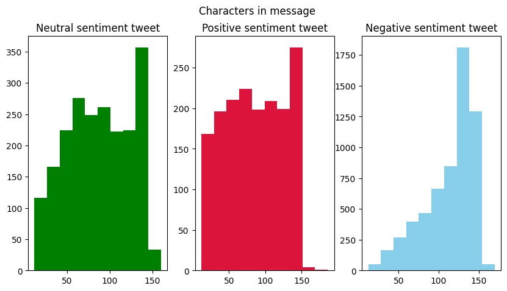
    


### Plot the Number of Words in a Tweet


```python
#Number of words in a tweet
fig,(ax1,ax2, ax3) = plt.subplots(1,3,figsize=(10,5))
tweet_len = data[data['airline_sentiment']==0]['text'].str.split().map(lambda x: len(x))
ax1.hist(tweet_len, color='green')
ax1.set_title('Neutral sentiment tweet')
tweet_len = data[data['airline_sentiment']==1]['text'].str.split().map(lambda x: len(x))
ax2.hist(tweet_len, color='blue')
ax2.set_title('Positive sentiment tweet')
tweet_len = data[data['airline_sentiment']==2]['text'].str.split().map(lambda x: len(x))
ax3.hist(tweet_len,color='purple')
ax3.set_title('Negative sentiment tweet')
fig.suptitle('Words in a tweet')
```


    Text(0.5, 0.98, 'Words in a tweet')


    
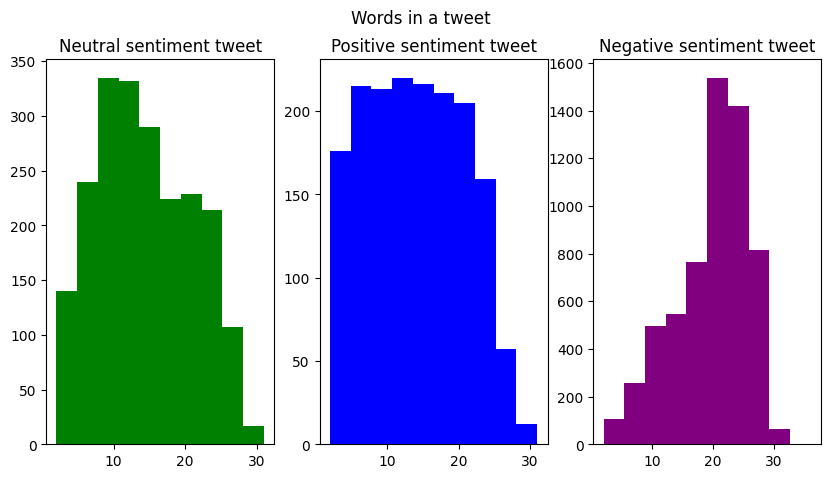
    


### Word Cloud for Negative Reviews


```python
from wordcloud import WordCloud,STOPWORDS
```


```python
#creating word cloud for negative reviews
negative_reviews=data[data['airline_sentiment']==2]
words = ' '.join(negative_reviews['text'])
cleaned_word = " ".join([word for word in words.split()])
```


```python
wordcloud = WordCloud(stopwords=STOPWORDS,
                      background_color='black',
                      width=3000,
                      height=2500
                     ).generate(cleaned_word)
```


```python
plt.figure(1,figsize=(12, 12))
plt.imshow(wordcloud)
plt.axis('off')
plt.show()
```


    
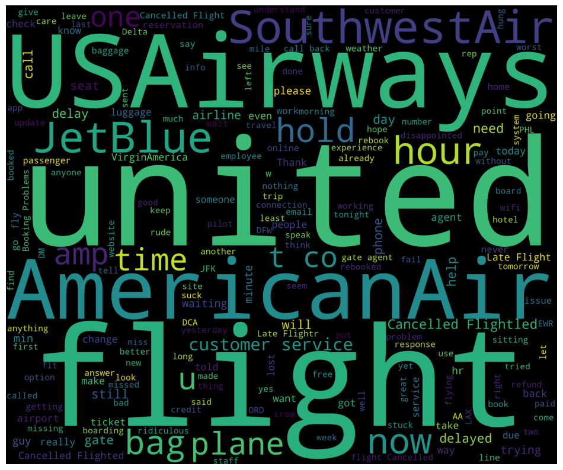
    


Delayed, lost, bad info, miss, Late, Cancelled Flight, hold, rude etc are some of the words apart from the Airline names like American Air, JetBlue, USAirways, Southwest 

### Word Cloud for Positive Reviews


```python
#creating word cloud for positive reviews
positive_reviews=data[data['airline_sentiment']==1]
words = ' '.join(positive_reviews['text'])
cleaned_word = " ".join([word for word in words.split()])
```


```python
wordcloud = WordCloud(stopwords=STOPWORDS,
                      background_color='black',
                      width=3000,
                      height=2500
                     ).generate(cleaned_word)
```


```python
plt.figure(1,figsize=(12, 12))
plt.imshow(wordcloud)
plt.axis('off')
plt.show()
```


    
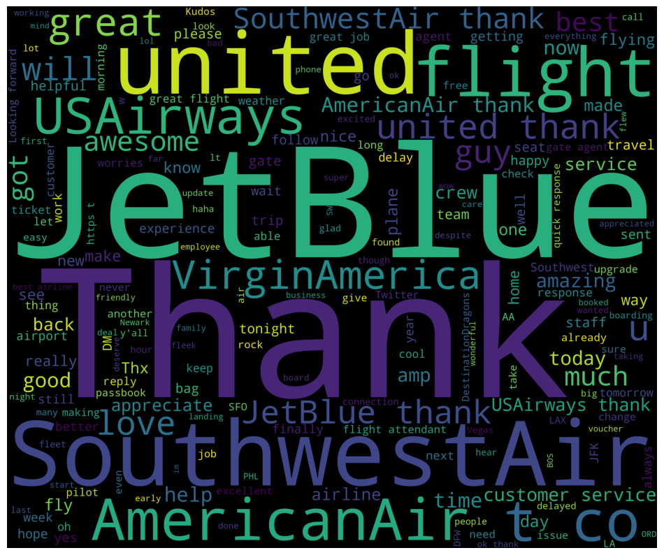
    


Love, Thank, made, much, awesome, amazing good, helpful, upgrade, great flight, oh, really friendly, plane , voucher were some of the words in Positive Reviews apart from the Airline names like JetBlue, United and Southwest

### Word Cloud for Neutral Reviews


```python
#creating word cloud for neutral reviews
neutral_reviews=data[data['airline_sentiment']==0]
words = ' '.join(neutral_reviews['text'])
cleaned_word = " ".join([word for word in words.split()])
```


```python
wordcloud = WordCloud(stopwords=STOPWORDS,
                      background_color='black',
                      width=3000,
                      height=2500
                     ).generate(cleaned_word)
```


```python
plt.figure(1,figsize=(12, 12))
plt.imshow(wordcloud)
plt.axis('off')
plt.show()
```


    
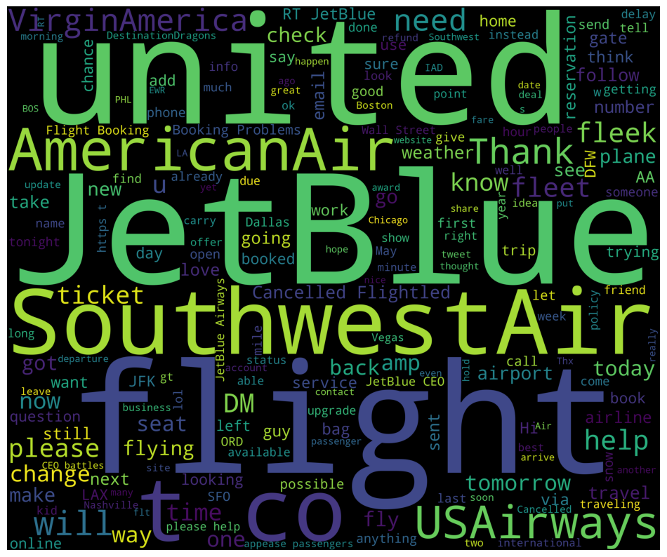
    


will, lol, possible, add, weather, someone, sure, call, already, flying, policy, offer are some of the words for Neutral reviews


```python
data['airline_sentiment'].unique()         #check the labels
```


    array([0, 1, 2])


```python
data['airline_sentiment'].value_counts()    
```


    2    6008
    0    2128
    1    1684
    Name: airline_sentiment, dtype: int64


```python
#plot the distribution of the class label
def bar_plot(data, feature):
    plot = sns.countplot(x =feature, data = data)
    total = len(data)
    for p in plot.patches:
        percentage = '{:.1f}%'.format(100 * p.get_height()/total)
        x = p.get_x() + p.get_width() / 2 - 0.05
        y = p.get_y() + p.get_height()
        plot.annotate(percentage, (x, y),ha="center",
            va="center",
            size=12,
            xytext=(0, 5),
            textcoords="offset points")
    plt.show()
    
bar_plot(data,'airline_sentiment')
```


    
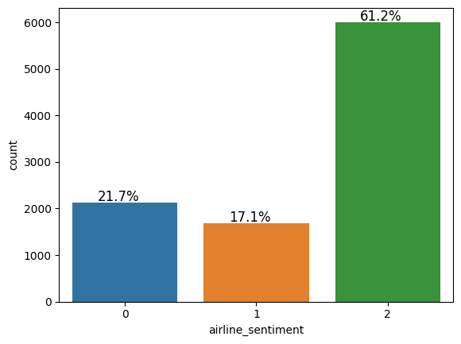
    


## Data Preprocessing

* Remove html tags
* Replace contractions in string. (e.g. replace I'm --> I am)
* Remove numbers
* Remove non-ascii
* Tokenization
* Remove Stopwords
* Lemmatized data
* We have used the NLTK library to tokenize words, remove stopwords and lemmatize the remaining words


```python
#remove the html tags
def strip_html(text):
    soup = BeautifulSoup(text, "html.parser")                    
    return soup.get_text()

#expand the contractions
def replace_contractions(text):
    """Replace contractions in string of text"""
    return contractions.fix(text)

#remove the numericals present in the text
def remove_numbers(text):
  text = re.sub(r'\d+', '', text)
  return text

def clean_text(text):
    text = strip_html(text)
    text = replace_contractions(text)
    text = remove_numbers(text)
    return text

data['text'] = data['text'].apply(lambda x: clean_text(x))
data.head()
```


<div>
<style scoped>
    .dataframe tbody tr th:only-of-type {
        vertical-align: middle;
    }

    .dataframe tbody tr th {
        vertical-align: top;
    }

    .dataframe thead th {
        text-align: right;
    }
</style>
<table border="1" class="dataframe">
  <thead>
    <tr style="text-align: right;">
      <th></th>
      <th>airline_sentiment</th>
      <th>airline_sentiment_confidence</th>
      <th>negativereason</th>
      <th>negativereason_confidence</th>
      <th>airline</th>
      <th>name</th>
      <th>retweet_count</th>
      <th>text</th>
      <th>tweet_created</th>
      <th>tweet_location</th>
      <th>user_timezone</th>
      <th>year</th>
      <th>month</th>
      <th>dates</th>
      <th>hour</th>
    </tr>
  </thead>
  <tbody>
    <tr>
      <th>0</th>
      <td>0</td>
      <td>1.0000</td>
      <td>Can't Tell</td>
      <td>0.6706</td>
      <td>Virgin America</td>
      <td>cairdin</td>
      <td>0</td>
      <td>@VirginAmerica What @dhepburn said.</td>
      <td>2015-02-24 11:35:52 -0800</td>
      <td>USA</td>
      <td>Eastern Time (US &amp; Canada)</td>
      <td>2015</td>
      <td>2</td>
      <td>24</td>
      <td>11</td>
    </tr>
    <tr>
      <th>1</th>
      <td>1</td>
      <td>0.3486</td>
      <td>Can't Tell</td>
      <td>0.0000</td>
      <td>Virgin America</td>
      <td>jnardino</td>
      <td>0</td>
      <td>@VirginAmerica plus you have added commercials...</td>
      <td>2015-02-24 11:15:59 -0800</td>
      <td>USA</td>
      <td>Pacific Time (US &amp; Canada)</td>
      <td>2015</td>
      <td>2</td>
      <td>24</td>
      <td>11</td>
    </tr>
    <tr>
      <th>2</th>
      <td>0</td>
      <td>0.6837</td>
      <td>Can't Tell</td>
      <td>0.6706</td>
      <td>Virgin America</td>
      <td>yvonnalynn</td>
      <td>0</td>
      <td>@VirginAmerica I did not today... Must mean I ...</td>
      <td>2015-02-24 11:15:48 -0800</td>
      <td>Lets Play</td>
      <td>Central Time (US &amp; Canada)</td>
      <td>2015</td>
      <td>2</td>
      <td>24</td>
      <td>11</td>
    </tr>
    <tr>
      <th>3</th>
      <td>2</td>
      <td>1.0000</td>
      <td>Bad Flight</td>
      <td>0.7033</td>
      <td>Virgin America</td>
      <td>jnardino</td>
      <td>0</td>
      <td>@VirginAmerica it is really aggressive to blas...</td>
      <td>2015-02-24 11:15:36 -0800</td>
      <td>USA</td>
      <td>Pacific Time (US &amp; Canada)</td>
      <td>2015</td>
      <td>2</td>
      <td>24</td>
      <td>11</td>
    </tr>
    <tr>
      <th>4</th>
      <td>2</td>
      <td>1.0000</td>
      <td>Can't Tell</td>
      <td>1.0000</td>
      <td>Virgin America</td>
      <td>jnardino</td>
      <td>0</td>
      <td>@VirginAmerica and it is a really big bad thin...</td>
      <td>2015-02-24 11:14:45 -0800</td>
      <td>USA</td>
      <td>Pacific Time (US &amp; Canada)</td>
      <td>2015</td>
      <td>2</td>
      <td>24</td>
      <td>11</td>
    </tr>
  </tbody>
</table>
</div>


### Tokenization


```python
data['text'] = data.apply(lambda row: nltk.word_tokenize(row['text']), axis=1) # Tokenization of data
data.head()
```


<div>
<style scoped>
    .dataframe tbody tr th:only-of-type {
        vertical-align: middle;
    }

    .dataframe tbody tr th {
        vertical-align: top;
    }

    .dataframe thead th {
        text-align: right;
    }
</style>
<table border="1" class="dataframe">
  <thead>
    <tr style="text-align: right;">
      <th></th>
      <th>airline_sentiment</th>
      <th>airline_sentiment_confidence</th>
      <th>negativereason</th>
      <th>negativereason_confidence</th>
      <th>airline</th>
      <th>name</th>
      <th>retweet_count</th>
      <th>text</th>
      <th>tweet_created</th>
      <th>tweet_location</th>
      <th>user_timezone</th>
      <th>year</th>
      <th>month</th>
      <th>dates</th>
      <th>hour</th>
    </tr>
  </thead>
  <tbody>
    <tr>
      <th>0</th>
      <td>0</td>
      <td>1.0000</td>
      <td>Can't Tell</td>
      <td>0.6706</td>
      <td>Virgin America</td>
      <td>cairdin</td>
      <td>0</td>
      <td>[@, VirginAmerica, What, @, dhepburn, said, .]</td>
      <td>2015-02-24 11:35:52 -0800</td>
      <td>USA</td>
      <td>Eastern Time (US &amp; Canada)</td>
      <td>2015</td>
      <td>2</td>
      <td>24</td>
      <td>11</td>
    </tr>
    <tr>
      <th>1</th>
      <td>1</td>
      <td>0.3486</td>
      <td>Can't Tell</td>
      <td>0.0000</td>
      <td>Virgin America</td>
      <td>jnardino</td>
      <td>0</td>
      <td>[@, VirginAmerica, plus, you, have, added, com...</td>
      <td>2015-02-24 11:15:59 -0800</td>
      <td>USA</td>
      <td>Pacific Time (US &amp; Canada)</td>
      <td>2015</td>
      <td>2</td>
      <td>24</td>
      <td>11</td>
    </tr>
    <tr>
      <th>2</th>
      <td>0</td>
      <td>0.6837</td>
      <td>Can't Tell</td>
      <td>0.6706</td>
      <td>Virgin America</td>
      <td>yvonnalynn</td>
      <td>0</td>
      <td>[@, VirginAmerica, I, did, not, today, ..., Mu...</td>
      <td>2015-02-24 11:15:48 -0800</td>
      <td>Lets Play</td>
      <td>Central Time (US &amp; Canada)</td>
      <td>2015</td>
      <td>2</td>
      <td>24</td>
      <td>11</td>
    </tr>
    <tr>
      <th>3</th>
      <td>2</td>
      <td>1.0000</td>
      <td>Bad Flight</td>
      <td>0.7033</td>
      <td>Virgin America</td>
      <td>jnardino</td>
      <td>0</td>
      <td>[@, VirginAmerica, it, is, really, aggressive,...</td>
      <td>2015-02-24 11:15:36 -0800</td>
      <td>USA</td>
      <td>Pacific Time (US &amp; Canada)</td>
      <td>2015</td>
      <td>2</td>
      <td>24</td>
      <td>11</td>
    </tr>
    <tr>
      <th>4</th>
      <td>2</td>
      <td>1.0000</td>
      <td>Can't Tell</td>
      <td>1.0000</td>
      <td>Virgin America</td>
      <td>jnardino</td>
      <td>0</td>
      <td>[@, VirginAmerica, and, it, is, a, really, big...</td>
      <td>2015-02-24 11:14:45 -0800</td>
      <td>USA</td>
      <td>Pacific Time (US &amp; Canada)</td>
      <td>2015</td>
      <td>2</td>
      <td>24</td>
      <td>11</td>
    </tr>
  </tbody>
</table>
</div>


### Lemmatization


```python
stopwords = stopwords.words('english')
stopwords = list(set(stopwords)) 
lemmatizer = WordNetLemmatizer()

#remove the non-ASCII characters
def remove_non_ascii(words):
    """Remove non-ASCII characters from list of tokenized words"""
    new_words = []
    for word in words:
        new_word = unicodedata.normalize('NFKD', word).encode('ascii', 'ignore').decode('utf-8', 'ignore')
        new_words.append(new_word)
    return new_words

# convert all characters to lowercase
def to_lowercase(words):
    """Convert all characters to lowercase from list of tokenized words"""
    new_words = []
    for word in words:
        new_word = word.lower()
        new_words.append(new_word)
    return new_words

# Remove the punctuations
def remove_punctuation(words):
    """Remove punctuation from list of tokenized words"""
    new_words = []
    for word in words:
        new_word = re.sub(r'[^\w\s]', '', word)
        if new_word != '':
            new_words.append(new_word)
    return new_words

# Remove the stop words
def remove_stopwords(words):
    """Remove stop words from list of tokenized words"""
    new_words = []
    for word in words:
        if word not in stopwords:
            new_words.append(word)
    return new_words

# lemmatize the words
def lemmatize_list(words):
    new_words = []
    for word in words:
      new_words.append(lemmatizer.lemmatize(word, pos='v'))
    return new_words

def normalize(words):
    words = remove_non_ascii(words)
    words = to_lowercase(words)
    words = remove_punctuation(words)
    words = remove_stopwords(words)
    words = lemmatize_list(words)
    return ' '.join(words)

#data['review'] = data['review'].astype(str)
data['text'] = data.apply(lambda row: normalize(row['text']), axis=1)
```


```python
data.head()
```


<div>
<style scoped>
    .dataframe tbody tr th:only-of-type {
        vertical-align: middle;
    }

    .dataframe tbody tr th {
        vertical-align: top;
    }

    .dataframe thead th {
        text-align: right;
    }
</style>
<table border="1" class="dataframe">
  <thead>
    <tr style="text-align: right;">
      <th></th>
      <th>airline_sentiment</th>
      <th>airline_sentiment_confidence</th>
      <th>negativereason</th>
      <th>negativereason_confidence</th>
      <th>airline</th>
      <th>name</th>
      <th>retweet_count</th>
      <th>text</th>
      <th>tweet_created</th>
      <th>tweet_location</th>
      <th>user_timezone</th>
      <th>year</th>
      <th>month</th>
      <th>dates</th>
      <th>hour</th>
    </tr>
  </thead>
  <tbody>
    <tr>
      <th>0</th>
      <td>0</td>
      <td>1.0000</td>
      <td>Can't Tell</td>
      <td>0.6706</td>
      <td>Virgin America</td>
      <td>cairdin</td>
      <td>0</td>
      <td>virginamerica dhepburn say</td>
      <td>2015-02-24 11:35:52 -0800</td>
      <td>USA</td>
      <td>Eastern Time (US &amp; Canada)</td>
      <td>2015</td>
      <td>2</td>
      <td>24</td>
      <td>11</td>
    </tr>
    <tr>
      <th>1</th>
      <td>1</td>
      <td>0.3486</td>
      <td>Can't Tell</td>
      <td>0.0000</td>
      <td>Virgin America</td>
      <td>jnardino</td>
      <td>0</td>
      <td>virginamerica plus add commercials experience ...</td>
      <td>2015-02-24 11:15:59 -0800</td>
      <td>USA</td>
      <td>Pacific Time (US &amp; Canada)</td>
      <td>2015</td>
      <td>2</td>
      <td>24</td>
      <td>11</td>
    </tr>
    <tr>
      <th>2</th>
      <td>0</td>
      <td>0.6837</td>
      <td>Can't Tell</td>
      <td>0.6706</td>
      <td>Virgin America</td>
      <td>yvonnalynn</td>
      <td>0</td>
      <td>virginamerica today must mean need take anothe...</td>
      <td>2015-02-24 11:15:48 -0800</td>
      <td>Lets Play</td>
      <td>Central Time (US &amp; Canada)</td>
      <td>2015</td>
      <td>2</td>
      <td>24</td>
      <td>11</td>
    </tr>
    <tr>
      <th>3</th>
      <td>2</td>
      <td>1.0000</td>
      <td>Bad Flight</td>
      <td>0.7033</td>
      <td>Virgin America</td>
      <td>jnardino</td>
      <td>0</td>
      <td>virginamerica really aggressive blast obnoxiou...</td>
      <td>2015-02-24 11:15:36 -0800</td>
      <td>USA</td>
      <td>Pacific Time (US &amp; Canada)</td>
      <td>2015</td>
      <td>2</td>
      <td>24</td>
      <td>11</td>
    </tr>
    <tr>
      <th>4</th>
      <td>2</td>
      <td>1.0000</td>
      <td>Can't Tell</td>
      <td>1.0000</td>
      <td>Virgin America</td>
      <td>jnardino</td>
      <td>0</td>
      <td>virginamerica really big bad thing</td>
      <td>2015-02-24 11:14:45 -0800</td>
      <td>USA</td>
      <td>Pacific Time (US &amp; Canada)</td>
      <td>2015</td>
      <td>2</td>
      <td>24</td>
      <td>11</td>
    </tr>
  </tbody>
</table>
</div>


## Supervised Learning Models
### Some popular techniques used for encoding text:
* Bag of Words
* TF-IDF (Term Frequency - Inverse Document Frequency)


### Bag of words (CountVectorizer)


```python
# Vectorization (Convert text data to numbers).
from sklearn.feature_extraction.text import CountVectorizer

Count_vec = CountVectorizer(max_features=500)                # Keep only 500 features as number of features will increase the processing time.
data_features = Count_vec.fit_transform(data['text'])

data_features = data_features.toarray()    
```


```python
data_features.shape
```


    (9820, 500)


```python
X = data_features

y = data.airline_sentiment
```


```python
# Split data into training and testing set.

from sklearn.model_selection import train_test_split

X_train, X_test, y_train, y_test = train_test_split(X, y, test_size=0.25, shuffle=False)
```


```python
# Finding optimal number of base learners using k-fold CV ->
base_ln = np.arange(100,400,100).tolist()
base_ln
```


    [100, 200, 300]


```python
# K-Fold Cross - validation .
cv_scores = []
for b in base_ln:
    clf = RandomForestClassifier(n_estimators = b)
    scores = cross_val_score(clf, X_train, y_train, cv = 5, scoring = 'accuracy')
    cv_scores.append(scores.mean())
```


```python
# plotting the error as k increases
error = [1 - x for x in cv_scores]                                 #error corresponds to each nu of estimator
optimal_learners = base_ln[error.index(min(error))]                #Selection of optimal nu of n_estimator corresponds to minimum error.
plt.plot(base_ln, error)                                           #Plot between each nu of estimator and misclassification error
xy = (optimal_learners, min(error))
plt.annotate('(%s, %s)' % xy, xy = xy, textcoords='data')
plt.xlabel("Number of base learners")
plt.ylabel("Misclassification Error")
plt.show()
```


    
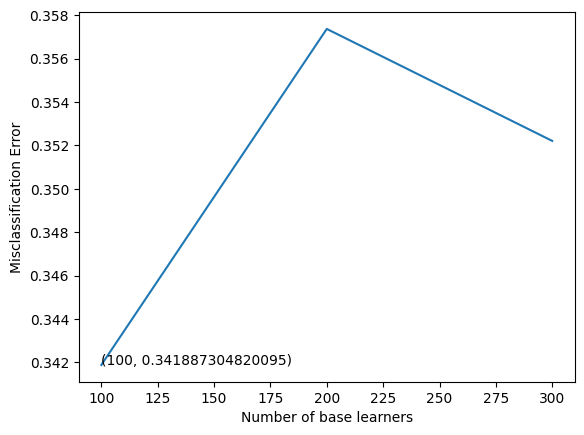
    


```python
# Training the best model and calculating accuracy on test data .
clf = RandomForestClassifier(n_estimators = optimal_learners)
clf.fit(X_train, y_train)
clf.score(X_test, y_test)
count_vectorizer_predicted = clf.predict(X_test)
print(classification_report(y_test , count_vectorizer_predicted , target_names = ['neutral', 'positive', 'negative']))
print("Accuracy of the model is : ",accuracy_score(y_test,count_vectorizer_predicted))
```

                  precision    recall  f1-score   support
    
         neutral       0.48      0.40      0.44       399
        positive       0.63      0.62      0.62       315
        negative       0.84      0.88      0.86      1741
    
        accuracy                           0.77      2455
       macro avg       0.65      0.63      0.64      2455
    weighted avg       0.76      0.77      0.76      2455
    
    Accuracy of the model is :  0.7665987780040733


```python
# Print and plot Confusion matirx to get an idea of how the distribution of the prediction is, among all the classes.

import matplotlib.pyplot as plt
import seaborn as sns
from sklearn.metrics import confusion_matrix

conf_mat = confusion_matrix(y_test, count_vectorizer_predicted)

print(conf_mat)

df_cm = pd.DataFrame(conf_mat, index = [i for i in ['neutral', 'positive', 'negative']],
                  columns = [i for i in ['neutral', 'positive', 'negative']])
plt.figure(figsize = (10,7))
sns.heatmap(df_cm, annot=True, fmt='g')
```

    [[ 161   44  194]
     [  32  194   89]
     [ 143   71 1527]]


    <AxesSubplot:>


    
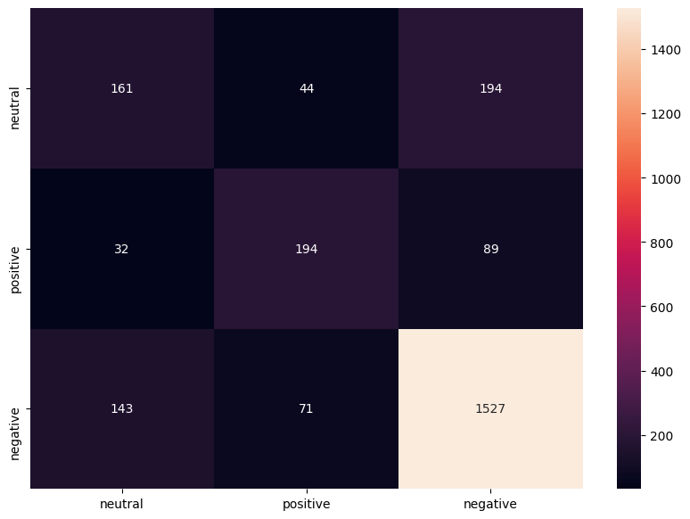
    


```python
all_features = Count_vec.get_feature_names()              #Instantiate the feature from the vectorizer
top_features=''                                            # Addition of top 40 feature into top_feature after training the model
feat=clf.feature_importances_
features=np.argsort(feat)[::-1]
for i in features[0:40]:
    top_features+=all_features[i]
    top_features+=','
    
print(top_features)  

print(" ") 
print(" ")     

from wordcloud import WordCloud
wordcloud = WordCloud(background_color="white",colormap='viridis',width=2000, 
                          height=1000).generate(top_features)

# Display the generated image:
plt.imshow(wordcloud, interpolation='bilinear')
plt.figure(1, figsize=(14, 11), frameon='equal')
plt.title('Top 40 features WordCloud', fontsize=20)
plt.axis("off")
plt.show()
```

    thank,unite,delay,http,flight,jetblue,usairways,great,love,get,southwestair,bag,hold,hours,cancel,awesome,amaze,time,go,virginamerica,help,make,fly,hour,please,would,need,know,best,follow,try,say,wait,customer,service,us,like,guy,good,still,
     
     


    
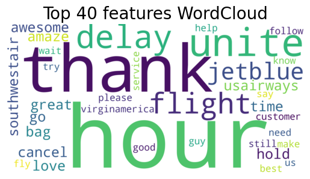
    


### TF-IDF - Term Frequency - Inverse Document Frequency


```python
# Using TfidfVectorizer to convert text data to numbers.

from sklearn.feature_extraction.text import TfidfVectorizer

tfidf_vect = TfidfVectorizer(max_features=500)
data_features = tfidf_vect.fit_transform(data['text'])

data_features = data_features.toarray()

data_features.shape     #feature shape
```


    (9820, 500)


```python
X = data_features

y = data.airline_sentiment
```


```python
# Split data into training and testing set.

from sklearn.model_selection import train_test_split

X_train, X_test, y_train, y_test = train_test_split(X, y, test_size=0.25, shuffle=False)
```


```python
# Finding optimal number of base learners using k-fold CV ->
base_ln = np.arange(100,400,100).tolist()
base_ln
```


    [100, 200, 300]


```python
# K-Fold Cross - validation .
cv_scores = []
for b in base_ln:
    clf = RandomForestClassifier(n_estimators = b)
    scores = cross_val_score(clf, X_train, y_train, cv = 5, scoring = 'accuracy')
    cv_scores.append(scores.mean())
```


```python
# plotting the error as k increases
error = [1 - x for x in cv_scores]                                 #error corresponds to each nu of estimator
optimal_learners = base_ln[error.index(min(error))]                #Selection of optimal nu of n_estimator corresponds to minimum error.
plt.plot(base_ln, error)                                           #Plot between each nu of estimator and misclassification error
xy = (optimal_learners, min(error))
plt.annotate('(%s, %s)' % xy, xy = xy, textcoords='data')
plt.xlabel("Number of base learners")
plt.ylabel("Misclassification Error")
plt.show()
```


    
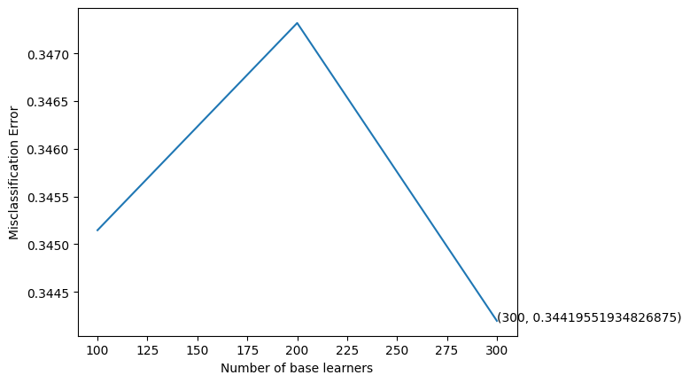
    


```python
# Training the best model and calculating accuracy on test data .
clf = RandomForestClassifier(n_estimators = optimal_learners)
clf.fit(X_train, y_train)
clf.score(X_test, y_test)
tf_idf_predicted = clf.predict(X_test)
print(classification_report(y_test , tf_idf_predicted , target_names = ['neutral', 'positive', 'negative']))
print("Accuracy of the model is : ",accuracy_score(y_test, tf_idf_predicted))
```

                  precision    recall  f1-score   support
    
         neutral       0.56      0.17      0.26       399
        positive       0.68      0.58      0.63       315
        negative       0.80      0.95      0.87      1741
    
        accuracy                           0.78      2455
       macro avg       0.68      0.57      0.59      2455
    weighted avg       0.75      0.78      0.74      2455
    
    Accuracy of the model is :  0.7767820773930754


```python
# Print and plot Confusion matirx to get an idea of how the distribution of the prediction is, among all the classes.

import matplotlib.pyplot as plt
import seaborn as sns
from sklearn.metrics import confusion_matrix

conf_mat = confusion_matrix(y_test, tf_idf_predicted)

print(conf_mat)

df_cm = pd.DataFrame(conf_mat, index = [i for i in ['neutral', 'positive', 'negative']],
                  columns = [i for i in ['neutral', 'positive', 'negative']])
plt.figure(figsize = (10,7))
sns.heatmap(df_cm, annot=True, fmt='g')
```

    [[  69   37  293]
     [  18  184  113]
     [  36   51 1654]]


    <AxesSubplot:>


    
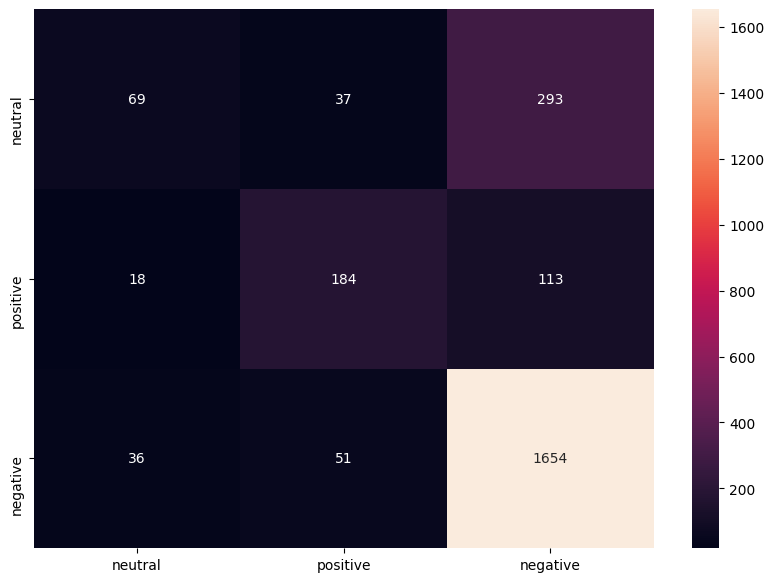
    


```python
all_features = tfidf_vect.get_feature_names()              #Instantiate the feature from the vectorizer
top_features=''                                            # Addition of top 40 feature into top_feature after training the model
feat=clf.feature_importances_
features=np.argsort(feat)[::-1]
for i in features[0:40]:
    top_features+=all_features[i]
    top_features+=', '
    
print(top_features)  

print(" ") 
print(" ") 

from wordcloud import WordCloud
wordcloud = WordCloud(background_color="white",colormap='viridis',width=2000, 
                          height=1000).generate(top_features)

# Display the generated image:
plt.imshow(wordcloud, interpolation='bilinear')
plt.figure(1, figsize=(14, 11), frameon='equal')
plt.title('Top 40 features WordCloud', fontsize=20)
plt.axis("off")
plt.show()
```

    thank, jetblue, unite, southwestair, http, usairways, flight, great, delay, virginamerica, love, get, awesome, cancel, fly, hold, amaze, hours, bag, please, best, follow, help, make, need, time, would, dm, know, go, hour, good, service, wait, guy, us, fleet, fleek, ticket, send, 
     
     


    
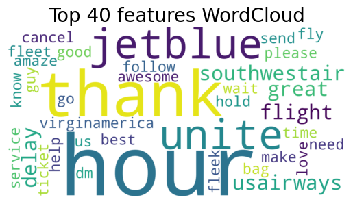
    


## Compare Supervised Learning Models


```python
#convert the test samples into a dataframe where the columns are
#the y_test(ground truth labels),tf-idf model predicted labels(tf_idf_predicted),Count Vectorizer model predicted labels(count_vectorizer_predicted)
df = pd.DataFrame(y_test.tolist(),columns =['y_test'])
df['count_vectorizer_predicted'] = count_vectorizer_predicted
df['tf_idf_predicted'] = tf_idf_predicted
df.head()
```


<div>
<style scoped>
    .dataframe tbody tr th:only-of-type {
        vertical-align: middle;
    }

    .dataframe tbody tr th {
        vertical-align: top;
    }

    .dataframe thead th {
        text-align: right;
    }
</style>
<table border="1" class="dataframe">
  <thead>
    <tr style="text-align: right;">
      <th></th>
      <th>y_test</th>
      <th>count_vectorizer_predicted</th>
      <th>tf_idf_predicted</th>
    </tr>
  </thead>
  <tbody>
    <tr>
      <th>0</th>
      <td>2</td>
      <td>2</td>
      <td>2</td>
    </tr>
    <tr>
      <th>1</th>
      <td>0</td>
      <td>2</td>
      <td>2</td>
    </tr>
    <tr>
      <th>2</th>
      <td>0</td>
      <td>0</td>
      <td>2</td>
    </tr>
    <tr>
      <th>3</th>
      <td>1</td>
      <td>1</td>
      <td>2</td>
    </tr>
    <tr>
      <th>4</th>
      <td>2</td>
      <td>2</td>
      <td>2</td>
    </tr>
  </tbody>
</table>
</div>


```python
#create bar plot to compare the accuaracies of Count Vectorizer and TF-IDF
import matplotlib.pyplot as plt
fig = plt.figure(figsize=(7,5))
ax = fig.add_axes([0,0,1,1])
subjects = ['Count_Vectorizer', 'TF-IDF']

# calculation accuracies of Count Vectorizer and TF-IDF using accuracy_score metrics
scores = [accuracy_score(y_test,count_vectorizer_predicted),accuracy_score(y_test,tf_idf_predicted)]
ax.bar(subjects,scores)
ax.set_ylabel('scores',fontsize= 12)    # y axis label
ax.set_xlabel('models',fontsize= 12)    # x axis label
ax.set_title('Accuaracies of Supervised Learning Methods')  # tittle
for i, v in enumerate(scores):
    ax.text( i ,v+0.01, '{:.2f}%'.format(100*v), color='black', fontweight='bold')     
    plt.savefig('barplot_1.png',dpi=100, format='png', bbox_inches='tight')
plt.show()
```


    
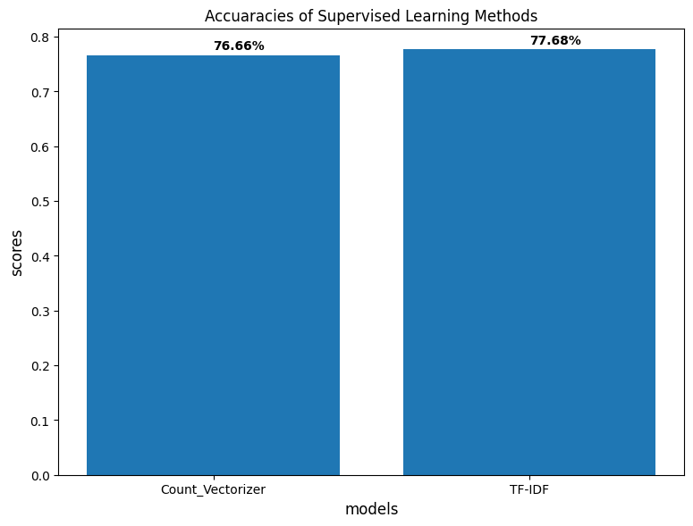
    


## Unsupervised Learning Models
### Some popular techniques used for unsupervised Sentiment Analysis:
* TextBlob
* VADER Sentiment


### VADER


```python
import nltk
#download vader lexicon
nltk.download('vader_lexicon')
from nltk.sentiment.vader import SentimentIntensityAnalyzer 

sentiment = SentimentIntensityAnalyzer()
```

    [nltk_data] Downloading package vader_lexicon to
    [nltk_data]     /home/jovyan/nltk_data...
    [nltk_data]   Package vader_lexicon is already up-to-date!


```python
data_new = data.copy()   #make a copy of dataframe and do unsupervised operations on that dataframe
```


```python
#Calculate the polarity score of the reviews
data_new['scores'] = data_new['text'].apply(lambda text: sentiment.polarity_scores(text))

data_new.head()
```


<div>
<style scoped>
    .dataframe tbody tr th:only-of-type {
        vertical-align: middle;
    }

    .dataframe tbody tr th {
        vertical-align: top;
    }

    .dataframe thead th {
        text-align: right;
    }
</style>
<table border="1" class="dataframe">
  <thead>
    <tr style="text-align: right;">
      <th></th>
      <th>airline_sentiment</th>
      <th>airline_sentiment_confidence</th>
      <th>negativereason</th>
      <th>negativereason_confidence</th>
      <th>airline</th>
      <th>name</th>
      <th>retweet_count</th>
      <th>text</th>
      <th>tweet_created</th>
      <th>tweet_location</th>
      <th>user_timezone</th>
      <th>year</th>
      <th>month</th>
      <th>dates</th>
      <th>hour</th>
      <th>scores</th>
    </tr>
  </thead>
  <tbody>
    <tr>
      <th>0</th>
      <td>0</td>
      <td>1.0000</td>
      <td>Can't Tell</td>
      <td>0.6706</td>
      <td>Virgin America</td>
      <td>cairdin</td>
      <td>0</td>
      <td>virginamerica dhepburn say</td>
      <td>2015-02-24 11:35:52 -0800</td>
      <td>USA</td>
      <td>Eastern Time (US &amp; Canada)</td>
      <td>2015</td>
      <td>2</td>
      <td>24</td>
      <td>11</td>
      <td>{'neg': 0.0, 'neu': 1.0, 'pos': 0.0, 'compound...</td>
    </tr>
    <tr>
      <th>1</th>
      <td>1</td>
      <td>0.3486</td>
      <td>Can't Tell</td>
      <td>0.0000</td>
      <td>Virgin America</td>
      <td>jnardino</td>
      <td>0</td>
      <td>virginamerica plus add commercials experience ...</td>
      <td>2015-02-24 11:15:59 -0800</td>
      <td>USA</td>
      <td>Pacific Time (US &amp; Canada)</td>
      <td>2015</td>
      <td>2</td>
      <td>24</td>
      <td>11</td>
      <td>{'neg': 0.0, 'neu': 1.0, 'pos': 0.0, 'compound...</td>
    </tr>
    <tr>
      <th>2</th>
      <td>0</td>
      <td>0.6837</td>
      <td>Can't Tell</td>
      <td>0.6706</td>
      <td>Virgin America</td>
      <td>yvonnalynn</td>
      <td>0</td>
      <td>virginamerica today must mean need take anothe...</td>
      <td>2015-02-24 11:15:48 -0800</td>
      <td>Lets Play</td>
      <td>Central Time (US &amp; Canada)</td>
      <td>2015</td>
      <td>2</td>
      <td>24</td>
      <td>11</td>
      <td>{'neg': 0.0, 'neu': 1.0, 'pos': 0.0, 'compound...</td>
    </tr>
    <tr>
      <th>3</th>
      <td>2</td>
      <td>1.0000</td>
      <td>Bad Flight</td>
      <td>0.7033</td>
      <td>Virgin America</td>
      <td>jnardino</td>
      <td>0</td>
      <td>virginamerica really aggressive blast obnoxiou...</td>
      <td>2015-02-24 11:15:36 -0800</td>
      <td>USA</td>
      <td>Pacific Time (US &amp; Canada)</td>
      <td>2015</td>
      <td>2</td>
      <td>24</td>
      <td>11</td>
      <td>{'neg': 0.345, 'neu': 0.468, 'pos': 0.187, 'co...</td>
    </tr>
    <tr>
      <th>4</th>
      <td>2</td>
      <td>1.0000</td>
      <td>Can't Tell</td>
      <td>1.0000</td>
      <td>Virgin America</td>
      <td>jnardino</td>
      <td>0</td>
      <td>virginamerica really big bad thing</td>
      <td>2015-02-24 11:14:45 -0800</td>
      <td>USA</td>
      <td>Pacific Time (US &amp; Canada)</td>
      <td>2015</td>
      <td>2</td>
      <td>24</td>
      <td>11</td>
      <td>{'neg': 0.486, 'neu': 0.514, 'pos': 0.0, 'comp...</td>
    </tr>
  </tbody>
</table>
</div>


```python
#Calculate the compund score of the reviews
data_new['compound']  = data_new['scores'].apply(lambda score_dict: score_dict['compound'])

data_new.head()
```


<div>
<style scoped>
    .dataframe tbody tr th:only-of-type {
        vertical-align: middle;
    }

    .dataframe tbody tr th {
        vertical-align: top;
    }

    .dataframe thead th {
        text-align: right;
    }
</style>
<table border="1" class="dataframe">
  <thead>
    <tr style="text-align: right;">
      <th></th>
      <th>airline_sentiment</th>
      <th>airline_sentiment_confidence</th>
      <th>negativereason</th>
      <th>negativereason_confidence</th>
      <th>airline</th>
      <th>name</th>
      <th>retweet_count</th>
      <th>text</th>
      <th>tweet_created</th>
      <th>tweet_location</th>
      <th>user_timezone</th>
      <th>year</th>
      <th>month</th>
      <th>dates</th>
      <th>hour</th>
      <th>scores</th>
      <th>compound</th>
    </tr>
  </thead>
  <tbody>
    <tr>
      <th>0</th>
      <td>0</td>
      <td>1.0000</td>
      <td>Can't Tell</td>
      <td>0.6706</td>
      <td>Virgin America</td>
      <td>cairdin</td>
      <td>0</td>
      <td>virginamerica dhepburn say</td>
      <td>2015-02-24 11:35:52 -0800</td>
      <td>USA</td>
      <td>Eastern Time (US &amp; Canada)</td>
      <td>2015</td>
      <td>2</td>
      <td>24</td>
      <td>11</td>
      <td>{'neg': 0.0, 'neu': 1.0, 'pos': 0.0, 'compound...</td>
      <td>0.0000</td>
    </tr>
    <tr>
      <th>1</th>
      <td>1</td>
      <td>0.3486</td>
      <td>Can't Tell</td>
      <td>0.0000</td>
      <td>Virgin America</td>
      <td>jnardino</td>
      <td>0</td>
      <td>virginamerica plus add commercials experience ...</td>
      <td>2015-02-24 11:15:59 -0800</td>
      <td>USA</td>
      <td>Pacific Time (US &amp; Canada)</td>
      <td>2015</td>
      <td>2</td>
      <td>24</td>
      <td>11</td>
      <td>{'neg': 0.0, 'neu': 1.0, 'pos': 0.0, 'compound...</td>
      <td>0.0000</td>
    </tr>
    <tr>
      <th>2</th>
      <td>0</td>
      <td>0.6837</td>
      <td>Can't Tell</td>
      <td>0.6706</td>
      <td>Virgin America</td>
      <td>yvonnalynn</td>
      <td>0</td>
      <td>virginamerica today must mean need take anothe...</td>
      <td>2015-02-24 11:15:48 -0800</td>
      <td>Lets Play</td>
      <td>Central Time (US &amp; Canada)</td>
      <td>2015</td>
      <td>2</td>
      <td>24</td>
      <td>11</td>
      <td>{'neg': 0.0, 'neu': 1.0, 'pos': 0.0, 'compound...</td>
      <td>0.0000</td>
    </tr>
    <tr>
      <th>3</th>
      <td>2</td>
      <td>1.0000</td>
      <td>Bad Flight</td>
      <td>0.7033</td>
      <td>Virgin America</td>
      <td>jnardino</td>
      <td>0</td>
      <td>virginamerica really aggressive blast obnoxiou...</td>
      <td>2015-02-24 11:15:36 -0800</td>
      <td>USA</td>
      <td>Pacific Time (US &amp; Canada)</td>
      <td>2015</td>
      <td>2</td>
      <td>24</td>
      <td>11</td>
      <td>{'neg': 0.345, 'neu': 0.468, 'pos': 0.187, 'co...</td>
      <td>-0.3306</td>
    </tr>
    <tr>
      <th>4</th>
      <td>2</td>
      <td>1.0000</td>
      <td>Can't Tell</td>
      <td>1.0000</td>
      <td>Virgin America</td>
      <td>jnardino</td>
      <td>0</td>
      <td>virginamerica really big bad thing</td>
      <td>2015-02-24 11:14:45 -0800</td>
      <td>USA</td>
      <td>Pacific Time (US &amp; Canada)</td>
      <td>2015</td>
      <td>2</td>
      <td>24</td>
      <td>11</td>
      <td>{'neg': 0.486, 'neu': 0.514, 'pos': 0.0, 'comp...</td>
      <td>-0.5829</td>
    </tr>
  </tbody>
</table>
</div>


```python
#Classify the class of the review by keeping threshold on the compund score
data_new['comp_score'] = data_new['compound'].apply(lambda c: '1' if c >=0 else '0')
data_new.head()
```


<div>
<style scoped>
    .dataframe tbody tr th:only-of-type {
        vertical-align: middle;
    }

    .dataframe tbody tr th {
        vertical-align: top;
    }

    .dataframe thead th {
        text-align: right;
    }
</style>
<table border="1" class="dataframe">
  <thead>
    <tr style="text-align: right;">
      <th></th>
      <th>airline_sentiment</th>
      <th>airline_sentiment_confidence</th>
      <th>negativereason</th>
      <th>negativereason_confidence</th>
      <th>airline</th>
      <th>name</th>
      <th>retweet_count</th>
      <th>text</th>
      <th>tweet_created</th>
      <th>tweet_location</th>
      <th>user_timezone</th>
      <th>year</th>
      <th>month</th>
      <th>dates</th>
      <th>hour</th>
      <th>scores</th>
      <th>compound</th>
      <th>comp_score</th>
    </tr>
  </thead>
  <tbody>
    <tr>
      <th>0</th>
      <td>0</td>
      <td>1.0000</td>
      <td>Can't Tell</td>
      <td>0.6706</td>
      <td>Virgin America</td>
      <td>cairdin</td>
      <td>0</td>
      <td>virginamerica dhepburn say</td>
      <td>2015-02-24 11:35:52 -0800</td>
      <td>USA</td>
      <td>Eastern Time (US &amp; Canada)</td>
      <td>2015</td>
      <td>2</td>
      <td>24</td>
      <td>11</td>
      <td>{'neg': 0.0, 'neu': 1.0, 'pos': 0.0, 'compound...</td>
      <td>0.0000</td>
      <td>1</td>
    </tr>
    <tr>
      <th>1</th>
      <td>1</td>
      <td>0.3486</td>
      <td>Can't Tell</td>
      <td>0.0000</td>
      <td>Virgin America</td>
      <td>jnardino</td>
      <td>0</td>
      <td>virginamerica plus add commercials experience ...</td>
      <td>2015-02-24 11:15:59 -0800</td>
      <td>USA</td>
      <td>Pacific Time (US &amp; Canada)</td>
      <td>2015</td>
      <td>2</td>
      <td>24</td>
      <td>11</td>
      <td>{'neg': 0.0, 'neu': 1.0, 'pos': 0.0, 'compound...</td>
      <td>0.0000</td>
      <td>1</td>
    </tr>
    <tr>
      <th>2</th>
      <td>0</td>
      <td>0.6837</td>
      <td>Can't Tell</td>
      <td>0.6706</td>
      <td>Virgin America</td>
      <td>yvonnalynn</td>
      <td>0</td>
      <td>virginamerica today must mean need take anothe...</td>
      <td>2015-02-24 11:15:48 -0800</td>
      <td>Lets Play</td>
      <td>Central Time (US &amp; Canada)</td>
      <td>2015</td>
      <td>2</td>
      <td>24</td>
      <td>11</td>
      <td>{'neg': 0.0, 'neu': 1.0, 'pos': 0.0, 'compound...</td>
      <td>0.0000</td>
      <td>1</td>
    </tr>
    <tr>
      <th>3</th>
      <td>2</td>
      <td>1.0000</td>
      <td>Bad Flight</td>
      <td>0.7033</td>
      <td>Virgin America</td>
      <td>jnardino</td>
      <td>0</td>
      <td>virginamerica really aggressive blast obnoxiou...</td>
      <td>2015-02-24 11:15:36 -0800</td>
      <td>USA</td>
      <td>Pacific Time (US &amp; Canada)</td>
      <td>2015</td>
      <td>2</td>
      <td>24</td>
      <td>11</td>
      <td>{'neg': 0.345, 'neu': 0.468, 'pos': 0.187, 'co...</td>
      <td>-0.3306</td>
      <td>0</td>
    </tr>
    <tr>
      <th>4</th>
      <td>2</td>
      <td>1.0000</td>
      <td>Can't Tell</td>
      <td>1.0000</td>
      <td>Virgin America</td>
      <td>jnardino</td>
      <td>0</td>
      <td>virginamerica really big bad thing</td>
      <td>2015-02-24 11:14:45 -0800</td>
      <td>USA</td>
      <td>Pacific Time (US &amp; Canada)</td>
      <td>2015</td>
      <td>2</td>
      <td>24</td>
      <td>11</td>
      <td>{'neg': 0.486, 'neu': 0.514, 'pos': 0.0, 'comp...</td>
      <td>-0.5829</td>
      <td>0</td>
    </tr>
  </tbody>
</table>
</div>


```python
data["VADER_pred"] = data_new['comp_score'].tolist()
data.head()
```


<div>
<style scoped>
    .dataframe tbody tr th:only-of-type {
        vertical-align: middle;
    }

    .dataframe tbody tr th {
        vertical-align: top;
    }

    .dataframe thead th {
        text-align: right;
    }
</style>
<table border="1" class="dataframe">
  <thead>
    <tr style="text-align: right;">
      <th></th>
      <th>airline_sentiment</th>
      <th>airline_sentiment_confidence</th>
      <th>negativereason</th>
      <th>negativereason_confidence</th>
      <th>airline</th>
      <th>name</th>
      <th>retweet_count</th>
      <th>text</th>
      <th>tweet_created</th>
      <th>tweet_location</th>
      <th>user_timezone</th>
      <th>year</th>
      <th>month</th>
      <th>dates</th>
      <th>hour</th>
      <th>VADER_pred</th>
    </tr>
  </thead>
  <tbody>
    <tr>
      <th>0</th>
      <td>0</td>
      <td>1.0000</td>
      <td>Can't Tell</td>
      <td>0.6706</td>
      <td>Virgin America</td>
      <td>cairdin</td>
      <td>0</td>
      <td>virginamerica dhepburn say</td>
      <td>2015-02-24 11:35:52 -0800</td>
      <td>USA</td>
      <td>Eastern Time (US &amp; Canada)</td>
      <td>2015</td>
      <td>2</td>
      <td>24</td>
      <td>11</td>
      <td>1</td>
    </tr>
    <tr>
      <th>1</th>
      <td>1</td>
      <td>0.3486</td>
      <td>Can't Tell</td>
      <td>0.0000</td>
      <td>Virgin America</td>
      <td>jnardino</td>
      <td>0</td>
      <td>virginamerica plus add commercials experience ...</td>
      <td>2015-02-24 11:15:59 -0800</td>
      <td>USA</td>
      <td>Pacific Time (US &amp; Canada)</td>
      <td>2015</td>
      <td>2</td>
      <td>24</td>
      <td>11</td>
      <td>1</td>
    </tr>
    <tr>
      <th>2</th>
      <td>0</td>
      <td>0.6837</td>
      <td>Can't Tell</td>
      <td>0.6706</td>
      <td>Virgin America</td>
      <td>yvonnalynn</td>
      <td>0</td>
      <td>virginamerica today must mean need take anothe...</td>
      <td>2015-02-24 11:15:48 -0800</td>
      <td>Lets Play</td>
      <td>Central Time (US &amp; Canada)</td>
      <td>2015</td>
      <td>2</td>
      <td>24</td>
      <td>11</td>
      <td>1</td>
    </tr>
    <tr>
      <th>3</th>
      <td>2</td>
      <td>1.0000</td>
      <td>Bad Flight</td>
      <td>0.7033</td>
      <td>Virgin America</td>
      <td>jnardino</td>
      <td>0</td>
      <td>virginamerica really aggressive blast obnoxiou...</td>
      <td>2015-02-24 11:15:36 -0800</td>
      <td>USA</td>
      <td>Pacific Time (US &amp; Canada)</td>
      <td>2015</td>
      <td>2</td>
      <td>24</td>
      <td>11</td>
      <td>0</td>
    </tr>
    <tr>
      <th>4</th>
      <td>2</td>
      <td>1.0000</td>
      <td>Can't Tell</td>
      <td>1.0000</td>
      <td>Virgin America</td>
      <td>jnardino</td>
      <td>0</td>
      <td>virginamerica really big bad thing</td>
      <td>2015-02-24 11:14:45 -0800</td>
      <td>USA</td>
      <td>Pacific Time (US &amp; Canada)</td>
      <td>2015</td>
      <td>2</td>
      <td>24</td>
      <td>11</td>
      <td>0</td>
    </tr>
  </tbody>
</table>
</div>


```python
#Calculate the accuracy of the Vader Sentiment Analysis
data["airline_sentiment"] = data["airline_sentiment"].astype(int)   #convert the sentiment column values into int data type
data["VADER_pred"] = data["VADER_pred"].astype(int) #convert the vader_predicted column values into int data type
print("Accuaracy using Vader Sentiment Analysis is : ",
      accuracy_score(data["airline_sentiment"].tolist(),data["VADER_pred"].tolist()))
```

    Accuaracy using Vader Sentiment Analysis is :  0.19389002036659878


```python
# Print and plot Confusion matirx to get an idea of how the distribution of the prediction is, among all the classes.

import matplotlib.pyplot as plt
import seaborn as sns
from sklearn.metrics import confusion_matrix

conf_mat = confusion_matrix(data["airline_sentiment"].tolist(), data['VADER_pred'].tolist())

print(conf_mat)

df_cm = pd.DataFrame(conf_mat, index = [i for i in ['neutral', 'positive', 'negative']],
                  columns = [i for i in ['neutral', 'positive', 'negative']])
plt.figure(figsize = (10,7))
sns.heatmap(df_cm, annot=True, fmt='g')
```

    [[ 279 1849    0]
     [  59 1625    0]
     [2654 3354    0]]


    <AxesSubplot:>


    
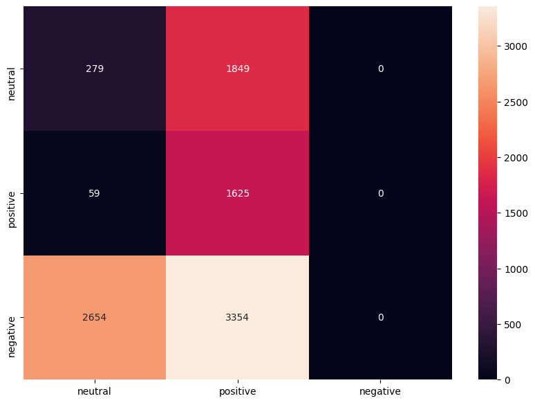
    


### TextBlob


```python
from textblob import TextBlob
```


```python
data_new = data.copy()   
```


```python
#Calculate the polarity score of the reviews
data_new['polarity']  = data_new['text'].apply(lambda text: TextBlob(text).sentiment.polarity)

data_new.head()
```


<div>
<style scoped>
    .dataframe tbody tr th:only-of-type {
        vertical-align: middle;
    }

    .dataframe tbody tr th {
        vertical-align: top;
    }

    .dataframe thead th {
        text-align: right;
    }
</style>
<table border="1" class="dataframe">
  <thead>
    <tr style="text-align: right;">
      <th></th>
      <th>airline_sentiment</th>
      <th>airline_sentiment_confidence</th>
      <th>negativereason</th>
      <th>negativereason_confidence</th>
      <th>airline</th>
      <th>name</th>
      <th>retweet_count</th>
      <th>text</th>
      <th>tweet_created</th>
      <th>tweet_location</th>
      <th>user_timezone</th>
      <th>year</th>
      <th>month</th>
      <th>dates</th>
      <th>hour</th>
      <th>VADER_pred</th>
      <th>polarity</th>
    </tr>
  </thead>
  <tbody>
    <tr>
      <th>0</th>
      <td>0</td>
      <td>1.0000</td>
      <td>Can't Tell</td>
      <td>0.6706</td>
      <td>Virgin America</td>
      <td>cairdin</td>
      <td>0</td>
      <td>virginamerica dhepburn say</td>
      <td>2015-02-24 11:35:52 -0800</td>
      <td>USA</td>
      <td>Eastern Time (US &amp; Canada)</td>
      <td>2015</td>
      <td>2</td>
      <td>24</td>
      <td>11</td>
      <td>1</td>
      <td>0.00000</td>
    </tr>
    <tr>
      <th>1</th>
      <td>1</td>
      <td>0.3486</td>
      <td>Can't Tell</td>
      <td>0.0000</td>
      <td>Virgin America</td>
      <td>jnardino</td>
      <td>0</td>
      <td>virginamerica plus add commercials experience ...</td>
      <td>2015-02-24 11:15:59 -0800</td>
      <td>USA</td>
      <td>Pacific Time (US &amp; Canada)</td>
      <td>2015</td>
      <td>2</td>
      <td>24</td>
      <td>11</td>
      <td>1</td>
      <td>0.00000</td>
    </tr>
    <tr>
      <th>2</th>
      <td>0</td>
      <td>0.6837</td>
      <td>Can't Tell</td>
      <td>0.6706</td>
      <td>Virgin America</td>
      <td>yvonnalynn</td>
      <td>0</td>
      <td>virginamerica today must mean need take anothe...</td>
      <td>2015-02-24 11:15:48 -0800</td>
      <td>Lets Play</td>
      <td>Central Time (US &amp; Canada)</td>
      <td>2015</td>
      <td>2</td>
      <td>24</td>
      <td>11</td>
      <td>1</td>
      <td>-0.31250</td>
    </tr>
    <tr>
      <th>3</th>
      <td>2</td>
      <td>1.0000</td>
      <td>Bad Flight</td>
      <td>0.7033</td>
      <td>Virgin America</td>
      <td>jnardino</td>
      <td>0</td>
      <td>virginamerica really aggressive blast obnoxiou...</td>
      <td>2015-02-24 11:15:36 -0800</td>
      <td>USA</td>
      <td>Pacific Time (US &amp; Canada)</td>
      <td>2015</td>
      <td>2</td>
      <td>24</td>
      <td>11</td>
      <td>0</td>
      <td>0.00625</td>
    </tr>
    <tr>
      <th>4</th>
      <td>2</td>
      <td>1.0000</td>
      <td>Can't Tell</td>
      <td>1.0000</td>
      <td>Virgin America</td>
      <td>jnardino</td>
      <td>0</td>
      <td>virginamerica really big bad thing</td>
      <td>2015-02-24 11:14:45 -0800</td>
      <td>USA</td>
      <td>Pacific Time (US &amp; Canada)</td>
      <td>2015</td>
      <td>2</td>
      <td>24</td>
      <td>11</td>
      <td>0</td>
      <td>-0.35000</td>
    </tr>
  </tbody>
</table>
</div>


```python
#Classify the class of the review by keeping threshold on the polarity score
data_new['polarity_score'] = data_new['polarity'].apply(lambda c: '1' if c >=0 else '0')

data_new.head()
```


<div>
<style scoped>
    .dataframe tbody tr th:only-of-type {
        vertical-align: middle;
    }

    .dataframe tbody tr th {
        vertical-align: top;
    }

    .dataframe thead th {
        text-align: right;
    }
</style>
<table border="1" class="dataframe">
  <thead>
    <tr style="text-align: right;">
      <th></th>
      <th>airline_sentiment</th>
      <th>airline_sentiment_confidence</th>
      <th>negativereason</th>
      <th>negativereason_confidence</th>
      <th>airline</th>
      <th>name</th>
      <th>retweet_count</th>
      <th>text</th>
      <th>tweet_created</th>
      <th>tweet_location</th>
      <th>user_timezone</th>
      <th>year</th>
      <th>month</th>
      <th>dates</th>
      <th>hour</th>
      <th>VADER_pred</th>
      <th>polarity</th>
      <th>polarity_score</th>
    </tr>
  </thead>
  <tbody>
    <tr>
      <th>0</th>
      <td>0</td>
      <td>1.0000</td>
      <td>Can't Tell</td>
      <td>0.6706</td>
      <td>Virgin America</td>
      <td>cairdin</td>
      <td>0</td>
      <td>virginamerica dhepburn say</td>
      <td>2015-02-24 11:35:52 -0800</td>
      <td>USA</td>
      <td>Eastern Time (US &amp; Canada)</td>
      <td>2015</td>
      <td>2</td>
      <td>24</td>
      <td>11</td>
      <td>1</td>
      <td>0.00000</td>
      <td>1</td>
    </tr>
    <tr>
      <th>1</th>
      <td>1</td>
      <td>0.3486</td>
      <td>Can't Tell</td>
      <td>0.0000</td>
      <td>Virgin America</td>
      <td>jnardino</td>
      <td>0</td>
      <td>virginamerica plus add commercials experience ...</td>
      <td>2015-02-24 11:15:59 -0800</td>
      <td>USA</td>
      <td>Pacific Time (US &amp; Canada)</td>
      <td>2015</td>
      <td>2</td>
      <td>24</td>
      <td>11</td>
      <td>1</td>
      <td>0.00000</td>
      <td>1</td>
    </tr>
    <tr>
      <th>2</th>
      <td>0</td>
      <td>0.6837</td>
      <td>Can't Tell</td>
      <td>0.6706</td>
      <td>Virgin America</td>
      <td>yvonnalynn</td>
      <td>0</td>
      <td>virginamerica today must mean need take anothe...</td>
      <td>2015-02-24 11:15:48 -0800</td>
      <td>Lets Play</td>
      <td>Central Time (US &amp; Canada)</td>
      <td>2015</td>
      <td>2</td>
      <td>24</td>
      <td>11</td>
      <td>1</td>
      <td>-0.31250</td>
      <td>0</td>
    </tr>
    <tr>
      <th>3</th>
      <td>2</td>
      <td>1.0000</td>
      <td>Bad Flight</td>
      <td>0.7033</td>
      <td>Virgin America</td>
      <td>jnardino</td>
      <td>0</td>
      <td>virginamerica really aggressive blast obnoxiou...</td>
      <td>2015-02-24 11:15:36 -0800</td>
      <td>USA</td>
      <td>Pacific Time (US &amp; Canada)</td>
      <td>2015</td>
      <td>2</td>
      <td>24</td>
      <td>11</td>
      <td>0</td>
      <td>0.00625</td>
      <td>1</td>
    </tr>
    <tr>
      <th>4</th>
      <td>2</td>
      <td>1.0000</td>
      <td>Can't Tell</td>
      <td>1.0000</td>
      <td>Virgin America</td>
      <td>jnardino</td>
      <td>0</td>
      <td>virginamerica really big bad thing</td>
      <td>2015-02-24 11:14:45 -0800</td>
      <td>USA</td>
      <td>Pacific Time (US &amp; Canada)</td>
      <td>2015</td>
      <td>2</td>
      <td>24</td>
      <td>11</td>
      <td>0</td>
      <td>-0.35000</td>
      <td>0</td>
    </tr>
  </tbody>
</table>
</div>


```python
data["Text_Blob_pred"] = data_new['polarity_score'].tolist()
data.head()
```


<div>
<style scoped>
    .dataframe tbody tr th:only-of-type {
        vertical-align: middle;
    }

    .dataframe tbody tr th {
        vertical-align: top;
    }

    .dataframe thead th {
        text-align: right;
    }
</style>
<table border="1" class="dataframe">
  <thead>
    <tr style="text-align: right;">
      <th></th>
      <th>airline_sentiment</th>
      <th>airline_sentiment_confidence</th>
      <th>negativereason</th>
      <th>negativereason_confidence</th>
      <th>airline</th>
      <th>name</th>
      <th>retweet_count</th>
      <th>text</th>
      <th>tweet_created</th>
      <th>tweet_location</th>
      <th>user_timezone</th>
      <th>year</th>
      <th>month</th>
      <th>dates</th>
      <th>hour</th>
      <th>VADER_pred</th>
      <th>Text_Blob_pred</th>
    </tr>
  </thead>
  <tbody>
    <tr>
      <th>0</th>
      <td>0</td>
      <td>1.0000</td>
      <td>Can't Tell</td>
      <td>0.6706</td>
      <td>Virgin America</td>
      <td>cairdin</td>
      <td>0</td>
      <td>virginamerica dhepburn say</td>
      <td>2015-02-24 11:35:52 -0800</td>
      <td>USA</td>
      <td>Eastern Time (US &amp; Canada)</td>
      <td>2015</td>
      <td>2</td>
      <td>24</td>
      <td>11</td>
      <td>1</td>
      <td>1</td>
    </tr>
    <tr>
      <th>1</th>
      <td>1</td>
      <td>0.3486</td>
      <td>Can't Tell</td>
      <td>0.0000</td>
      <td>Virgin America</td>
      <td>jnardino</td>
      <td>0</td>
      <td>virginamerica plus add commercials experience ...</td>
      <td>2015-02-24 11:15:59 -0800</td>
      <td>USA</td>
      <td>Pacific Time (US &amp; Canada)</td>
      <td>2015</td>
      <td>2</td>
      <td>24</td>
      <td>11</td>
      <td>1</td>
      <td>1</td>
    </tr>
    <tr>
      <th>2</th>
      <td>0</td>
      <td>0.6837</td>
      <td>Can't Tell</td>
      <td>0.6706</td>
      <td>Virgin America</td>
      <td>yvonnalynn</td>
      <td>0</td>
      <td>virginamerica today must mean need take anothe...</td>
      <td>2015-02-24 11:15:48 -0800</td>
      <td>Lets Play</td>
      <td>Central Time (US &amp; Canada)</td>
      <td>2015</td>
      <td>2</td>
      <td>24</td>
      <td>11</td>
      <td>1</td>
      <td>0</td>
    </tr>
    <tr>
      <th>3</th>
      <td>2</td>
      <td>1.0000</td>
      <td>Bad Flight</td>
      <td>0.7033</td>
      <td>Virgin America</td>
      <td>jnardino</td>
      <td>0</td>
      <td>virginamerica really aggressive blast obnoxiou...</td>
      <td>2015-02-24 11:15:36 -0800</td>
      <td>USA</td>
      <td>Pacific Time (US &amp; Canada)</td>
      <td>2015</td>
      <td>2</td>
      <td>24</td>
      <td>11</td>
      <td>0</td>
      <td>1</td>
    </tr>
    <tr>
      <th>4</th>
      <td>2</td>
      <td>1.0000</td>
      <td>Can't Tell</td>
      <td>1.0000</td>
      <td>Virgin America</td>
      <td>jnardino</td>
      <td>0</td>
      <td>virginamerica really big bad thing</td>
      <td>2015-02-24 11:14:45 -0800</td>
      <td>USA</td>
      <td>Pacific Time (US &amp; Canada)</td>
      <td>2015</td>
      <td>2</td>
      <td>24</td>
      <td>11</td>
      <td>0</td>
      <td>0</td>
    </tr>
  </tbody>
</table>
</div>


```python
#Calculate the accuracy of the Text Blob Analysis
data["airline_sentiment"] = data["airline_sentiment"].astype(int)  #convert the sentiment column values into int data type
data["Text_Blob_pred"] = data["Text_Blob_pred"].astype(int)  #convert the textblob predicted column values into int data type
print("Accuaracy of using Text Blob Sentiment Analysis is : ",
      accuracy_score(data["airline_sentiment"].tolist(),data["Text_Blob_pred"].tolist()))
```

    Accuaracy of using Text Blob Sentiment Analysis is :  0.18116089613034622


```python
# Print and plot Confusion matirx to get an idea of how the distribution of the prediction is, among all the classes.

import matplotlib.pyplot as plt
import seaborn as sns
from sklearn.metrics import confusion_matrix

conf_mat = confusion_matrix(data["airline_sentiment"].tolist(), data['Text_Blob_pred'].tolist())

print(conf_mat)

df_cm = pd.DataFrame(conf_mat, index = [i for i in [0, 1, 2]],
                  columns = [i for i in [0, 1, 2]])
plt.figure(figsize = (10,7))
sns.heatmap(df_cm, annot=True, fmt='g')
```

    [[ 166 1962    0]
     [  71 1613    0]
     [1720 4288    0]]


    <AxesSubplot:>


    
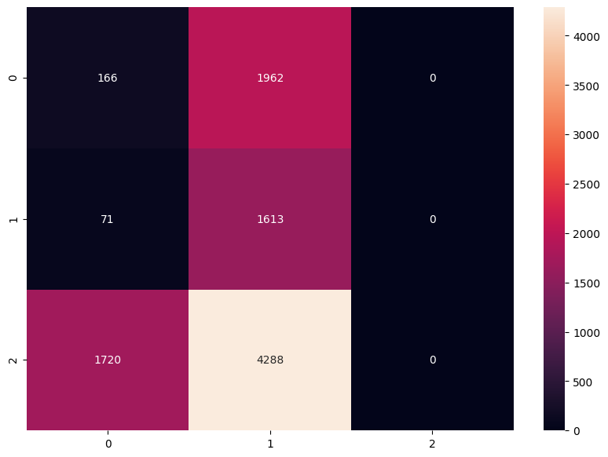
    


## Compare Unsupervised Learning Models


```python
#plot the accuaracies of the text blob and Vader
import matplotlib.pyplot as plt
fig = plt.figure(figsize=(7,5))
ax = fig.add_axes([0,0,1,1])
subjects = ['Vader', 'Text Blob']
# calculation accuracies of Vader and Textblob models using accuracy_score metrics
scores = [accuracy_score(data["airline_sentiment"].tolist(),data["VADER_pred"].tolist()),accuracy_score(data["airline_sentiment"].tolist(),data["Text_Blob_pred"].tolist())]
ax.bar(subjects,scores)
ax.set_ylabel('scores',fontsize= 12)   # y-axis labels
ax.set_xlabel('models',fontsize= 12)   # x-axis labels
ax.set_title('Accuaracies of UnSupervised Learning Methods')   #tittle of the graph
for i, v in enumerate(scores):
    ax.text( i ,v+0.01, '{:.2f}%'.format(100*v), color='black', fontweight='bold')
    plt.savefig('barplot_1.png',dpi=100, format='png', bbox_inches='tight')
plt.show()
```


    
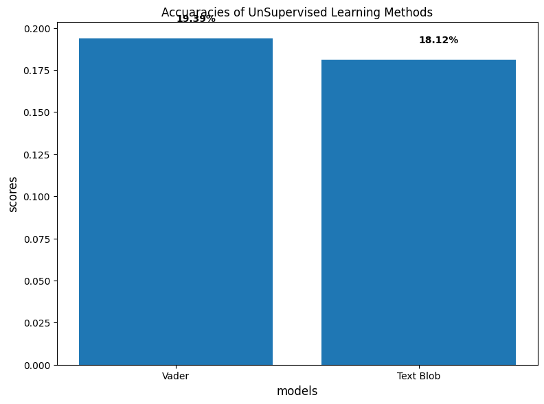
    


## Observations
* Supervised learning model seems to have performed better with TF-IDF scoring 77.31 % accuracy
* Unsupervised learning model seems to have NOT performed well 


```python

```
